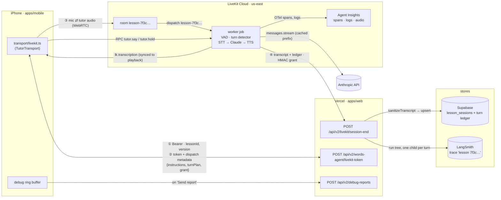
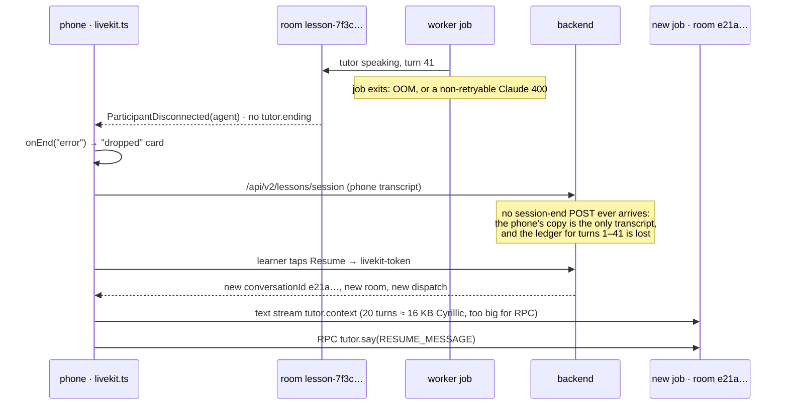

# Our own voice pipeline on LiveKit + Claude — research

**Date:** 2026-09-11 · **Status:** RESEARCHED. Nothing is built and nothing is decided. This note answers
the ten open questions from the placeholder. It lists the problems we would inherit, then proposes a test
plan and a debug/monitoring design.

**How facts were checked.**
- LiveKit facts come from the 1.8.1 sources of `livekit-agents` (Python) and `@livekit/agents` (Node),
  both released 2026-09-10. The Anthropic plugins were read at the same version. The LiveKit docs and
  pricing were read on 2026-09-11.
- Claude facts come from the Anthropic docs, including the model-deprecations page.
- Repo facts are cited as `path:line`.
- Anything marked **(estimate)** or **(verify)** is not measured.

**Where this came from.** `docs/2026-09-11-voice-provider-pricing.md` §4 and §8 (candidate #6) found this
is the cheapest way to keep Claude as the tutor's brain. The modelled cost is about $0.045–0.08 per
lesson-minute, against about $0.10 on ElevenLabs or `gpt-realtime`.

---

## 0. Verdict first

**It is buildable. The saving is real, but it only pays off at tens of learners.** Below that, the case
has to be control and observability, not money. The work is less about wiring a pipeline, which LiveKit
does well, and more about four things we would now own:

1. **Claude integration.** Both LiveKit Anthropic plugins trail the current Claude API. Section 3.2
   lists the problems we verified in their source. **We should plan to write our own ~300-line Claude LLM adapter.**
2. **Turn-taking for non-native speakers.** A B2 learner hunting for a word pauses mid-sentence. A
   premature end-of-turn makes the tutor talk over them, which is the worst thing a tutor can do. LiveKit
   has a good audio turn detector, but it is only free when the worker is hosted on LiveKit Cloud (§3.4).
3. **Voice with Russian code-switching.** The prompt asks the tutor to say Russian words "properly
   pronounced, never read as if they were English" (`apps/web/src/agent/prompts/podcast-lesson.ts:76`).
   The TTS voices in the cost model (Inworld, Cartesia) have to be proven on mixed EN/RU sentences. So
   does the STT on a learner who answers in Russian.
4. **A real-time service on call.** That means a long-lived worker, four vendors in series (LiveKit, STT,
   Claude, TTS), deploy draining, and memory leaks. We have none of this today: the backend is serverless
   and every current provider is a managed agent.

**Recommendation.**
- Run a **bounded spike** of about 1 week (estimate), with the go/no-go gates in §7.
- Use a **TypeScript worker on LiveKit Cloud (Ship plan), Claude Sonnet 5 with thinking off, our own
  Claude adapter, and ElevenLabs Flash via our own key as the first TTS.** Flash is the known-good voice;
  cheaper voices get swapped in afterwards under a blind test.
- Build the **per-turn ledger and the correlation id before anything else** (§5). They make every other
  question measurable.
- **Infrastructure at 1–10 learners (§9):** the spike runs at $0 on LiveKit's Build plan, with the worker
  local in dev mode. Real learners need Ship at $50/mo, which comes to $120–160/mo at 10 learners.
  Self-hosting saves at most $70–135/mo at 10 learners, and it costs the turn-taking models we need most.
  Don't self-host at this scale.

**Decided 2026-09-20: start on LiveKit Cloud.** Self-hosting the room/SFU or the worker is not on the
table now — see the previous paragraph. The ask is narrower: don't let the build quietly wire Cloud-only
assumptions into call sites that would make a later move (to self-hosted LiveKit, or to a different
worker host) a rewrite instead of a config change. §1 names the four seams to keep clean; none of them
cost anything to respect now, because the spike's own shape (§1, §5.4) already does three of the four.
This is a constraint on *how* the spike code is written, not a reason to build anything the spike doesn't
already need — see `CLAUDE.md`'s stance against speculative abstraction.

---

## 1. The shape

The phone joins a LiveKit room over WebRTC. A LiveKit Agents worker job is dispatched into the same room.
We buy each piece separately: LiveKit for transport, STT and TTS from vendors we choose, and Claude on our
own Anthropic key.

The one design choice that simplifies everything else: **the backend builds the session and the worker is
prompt-agnostic.** This is the same shape as the OpenAI token route, which builds `instructions` server-side
(`apps/web/src/app/api/v2/words-agent/openai-token/route.ts:115`). The new token route does the following:

- resolves the version and items;
- builds `instructions` (`config.prompt.replaceAll("{{items_list}}", formatItemsList(items))`);
- mints a room token whose `roomConfig` dispatches the agent;
- puts `{conversationId, version, instructions, turnPlan, llm, voice, grant}` in the **dispatch metadata**
  (limit 512 KiB). The phone can decode its own token and read this — see §3.10 — which is fine: nothing
  in it is a secret, only this lesson's own prompt and items.

The consequences:

- **The worker never imports `apps/web`.** No app→app import, and no worker deploy when a prompt changes.
  A prompt edit ships with the web app, as it does for OpenAI.
- **The worker needs no Supabase key.** It writes back through backend routes and authenticates with a
  per-lesson `grant`: an HMAC over `{conversationId, ownerId, exp}` that the token route signs. The grant
  can only write the lesson it was minted for. That keeps "secrets stay server-side" and "ownership is
  enforced in code" true. It also lets the `add_words_to_collection` tool write with the **real owner**,
  instead of `ANONYMOUS` as it does today (`apps/web/src/agent/prompts/types.ts:197-203`).
- **Worker language stops being forced.** Python becomes viable, because nothing has to be imported. §2 Q2
  still recommends TypeScript, for the wire contract.

**Portability, so a later self-host isn't a rewrite.** LiveKit Cloud and the open-source LiveKit server
speak the same protocol — `@livekit/agents`, `livekit-server-sdk` and `livekit-client` don't know which
one they're talking to, so the room/SFU vendor is a `LIVEKIT_URL` and a key pair, not a code path. What
*would* wire us to Cloud specifically, if we're not careful, is four things — keep each behind the seam
the spike already needs for its own sake, not a new abstraction:

1. **The free hosted turn detector (`v1`).** `turn_handling` is already config, not code (§2 Q4's table).
   Keep it that way — a self-hosted worker falling back to `v1-mini`, or paying for Cloud's inference API
   standalone, should be a value in that config, never a call-site branch. This is the one piece migration
   can't make free again: it's a vendor/quality trade to re-run at migration time, not something code
   abstracts away.
2. **Process lifecycle.** `lk agent deploy`'s rolling deploy and drain are external to the worker. As long
   as shutdown is written to the generic contract — `session.shutdown()` on SIGTERM, the ledger flushed
   incrementally (§3.7) rather than only at the end — a container platform's SIGTERM does the same job.
3. **Observability.** Route the worker's OTel spans through a `FanoutSpanProcessor` (§5.4), not by handing
   LiveKit Cloud the tracer provider outright. That's already required to keep our own exporter working
   *today*; it's also what lets a self-hosted stack add its own collector later without touching call sites.
4. **Dispatch.** `RoomAgentDispatch` via `roomConfig` is core LiveKit server API, not a Cloud feature — it
   survives a self-host move unchanged, so there's nothing to isolate here.

None of this changes what gets built for the spike (§7) or the go/no-go gates (§7) — it changes which of
two equally-easy ways to wire config, lifecycle and tracing we pick while building it.



*One id, `7f3c…`, runs through the whole picture. It names the room, the `lesson_sessions` row, the
LangSmith trace and the debug report. Five systems, one grep. §5.1 explains why this matters more than any
dashboard.*

---

## 2. The ten open questions, answered

### Q1 — Where the worker runs

| Option | For | Against |
|---|---|---|
| **LiveKit Cloud agent hosting** (recommended) | `lk agent deploy`, rolling deploys, rollback on paid plans. The **audio turn detector `v1` and adaptive interruption are free here**. Agent Insights built in. | Regions only `us-east`, `eu-central`, `ap-south`, and a deployment's region can't be changed. **Build plan cold-starts in 10–20 s** (a lesson start would wait), so testing needs Ship ($50/mo) or higher. Per-session CPU/RAM is not published. |
| Container we host (Fly, Railway, ECS) | Full control and any region. The worker connects *out* over WebSocket, so no inbound ports. | We own draining (SIGTERM, `drain_timeout` 1 h default, platform grace ≥ 10 min), health checks on `:8081`, and capacity (4 cores / 8 GB ≈ 10–25 jobs; LiveKit's test put 30 agents at 3.8 cores and 2.8 GB). **In `start` mode the turn detector falls back to local `v1-mini` and interruptions to VAD-only.** Pricing for `v1` outside Cloud is unclear. |
| Vercel | — | **Not possible.** Functions are request-triggered and capped at 300 s by default (800 s max, 1800 s beta). WebSockets there are inbound and close at max duration. A worker needs an always-on outbound registration socket, forked job processes and hour-long drains. Vercel stays the home of the token and session-end routes. |

**Region:** us-east (estimate).
- Per turn, the worker makes three API calls (STT, Claude, TTS), and all three vendors are US-heavy.
- The learner's media makes one trip to their nearest LiveKit edge, then rides LiveKit's backbone.
- A European learner therefore pays one media-path RTT once. An EU worker would pay three
  transatlantic API round-trips every turn.
- Measure it in the spike (`e2e_latency` from both regions).

### Q2 — Language

**TypeScript (`@livekit/agents` 1.8.1). Node now ships in lockstep with Python and is close to parity.**

- **Node has** the audio turn detector (`inference.TurnDetector`), adaptive interruption, noise
  cancellation, tool calling, the test framework (Vitest: `session.run`, `.judge()`, mock tools), OTel
  (`telemetry.setTracerProvider`), `lk agent console`, simulations, and `FallbackAdapter` for STT, TTS and
  LLM (confirmed in the 1.8.1 dist).
- **Python only:** MCP, pre-connect audio, AGC, `JudgeGroup` with its 8 built-in judges, the native
  LangSmith integration (`langsmith[livekit]`), and about 60 plugins against Node's ~37.

Why TypeScript anyway:
- The phone↔worker wire contract (RPC names, payloads, the turn-ledger shape) can live in
  `packages/shared` and be imported by both ends. It is pure types and codecs, so it passes the package's
  "fix it by deploying the web app alone?" test. A Python worker would have to keep a copy that drifts.
- `sanitizeTranscript`, the `session.ts` constants and `formatResumeContext` come for free.
- The Python-only gaps don't bite us:
  - We call our one tool directly, so we don't need MCP.
  - The judge is ten lines of our own code.
  - LangSmith already has a TypeScript bridge (`apps/web/src/lib/langsmith-trace.ts`), reused through the
    session-end route (§5.2).

Risks that would move us to Python: open agents-js bugs.
- Memory leaks: #2053, #1950, #2046.
- **Deepgram STT never reconnecting after its WebSocket closes: #2469.** In a 20-minute lesson this means a
  deaf tutor.
- A dead prewarmed process being reused: #2321.

If these reproduce under the load test (§4 L6), reconsider. Pipecat (Python, Daily transport) is the other
exit; see §8.

### Q3 — Latency

There is no measurement yet, for this provider **or for the three we run today.** Nothing in the app
records time-to-first-audio (repo search: not found). **Add that first, provider-agnostically** (§5.3), or
there is nothing to compare against.

Budget from end of learner speech to first tutor audio. These are estimates built from published parts:

| Stage | Number | Source |
|---|---|---|
| End-of-turn decision (turn detector `v1`) | 295 ms mean at 10% false cutoffs, 543 ms at 5% | [LiveKit EOT blog](https://livekit.com/blog/solving-end-of-turn-detection) |
| Endpointing floor with the audio detector | `min_delay` 0.3 s (default 0.5 s without it) | 1.8.1 `voice/turn.py` |
| STT final | 100–200 ms (overlaps the above) | [LiveKit pipeline blog](https://livekit.com/blog/voice-agent-architecture-stt-llm-tts-pipelines-explained) |
| **Claude TTFT, 10k-token input** | **Haiku 4.5 ≈ 0.76 s · Sonnet 4.6 ≈ 2.2 s** on the Anthropic API · Sonnet 5: not published | [Artificial Analysis](https://artificialanalysis.ai/models/claude-4-5-haiku/providers) |
| TTS time-to-first-byte | 100–300 ms | same blog |
| WebRTC | < 50 ms | same blog |

**Estimate:** about 1.2–1.8 s with Haiku and more with Sonnet. Measured fleets of other vendors' agents
sit at p50 680 ms and p95 1,180 ms ([DestiLabs](https://www.destilabs.com/blog/ai-voice-agent-benchmark-2026)).

What closes the gap:
- **Preemptive generation**, on by default, starts Claude on the interim transcript before end-of-turn is
  decided. The cost: every discarded attempt is a billed Claude request (`max_retries` 3).
- **Streaming TTS from the first sentence** happens by default.
- **A cached prefix** matters a lot for TTFT late in a lesson, when the input is 10k+ tokens (§3.2).
- **Thinking off** matters too. Sonnet 5 thinks adaptively by default, which puts thinking time in front of
  the first spoken word.

The pedagogy helps us here. The tutor talks about 90% of the lesson (pricing note §2), so most turns are
long monologues where one slow first sentence is less noticeable than in a chatty agent.

### Q4 — Turn-taking quality

In 1.8, `turn_handling={endpointing, interruption, preemptive_generation, user_turn_limit}` replaces the
old flat options (`min_endpointing_delay`, `allow_interruptions`, …), which are deprecated for v2.0.

Our three plans can map onto it. **These are starting points (estimate); tune them with the replay corpus
in §4 L4:**

| Plan (Vapi values, `apps/web/src/agent/vapi-assistant.ts:66-73`) | `endpointing.min_delay` / `max_delay` | `interruption.min_duration` / `min_words` |
|---|---|---|
| patient (wait 1.0 s, stop after 3 words) — used by words-3.x | 0.8 s / 4.0 s | 0.8 s / 2 |
| normal (wait 0.4 s) | 0.5 s / 3.0 s | 0.5 s / 1 |
| eager (wait 0.2 s) | 0.3 s / 2.0 s | 0.3 s / 0 |

What LiveKit gives us for learners who pause:
- The **audio** turn detector reads intonation, so "I think it's… [pause]" with rising or held pitch is not
  treated as a finished turn. A silence-only VAD can't do that.
- `endpointing.mode: "dynamic"` adapts the delay per speaker, using an EMA (α 0.9).
- **Adaptive interruption** ignores backchannels ("uh-huh", "yeah") and needs an STT with aligned
  transcripts.
- `resume_false_interruption` resumes the tutor if a detected interruption yields no words within 2 s.
- `aec_warmup_duration` (3 s) ignores barge-in right after the tutor starts, which guards against the
  tutor's own echo.

What it can't give us: a guarantee on *our* learners. The detector covers 14 languages. We need to know
how it behaves on Russian-accented English with code-switching, and only our own recordings answer that
(§4 L4).

### Q5 — Voice

Pronunciation is the product, and this prompt makes the voice test harder than a generic one.
- **Russian mid-sentence.** Every item's TRANSLATION step speaks Russian synonyms inside an English
  sentence (`podcast-lesson.ts:83`). A TTS that reads "мимолётный" with English phonetics, or switches
  voice timbre mid-sentence, fails the lesson.
- **Stress moves in word families.** The FORMS step walks the family, and stress shifts
  (`podcast-lesson.ts:84`, e.g. PHOtograph → phoTOgraphy). Homographs matter too ("read", "live",
  "record").

Consequences:
- **The first TTS is ElevenLabs Flash (or Turbo) on our own key.** ElevenLabs was **removed from LiveKit
  Inference on 2026-08-31**, but the plugin works with our own key. It's the voice family we already
  accept. It costs more (about $0.043/min against Inworld's ≈ $0.021), but it removes one unknown from the
  spike.
- **A blind listening test before any swap.** Use 20 real tutor turns taken from stored transcripts, each
  containing a Russian insert and a stress-shifting form. Voice them with `eleven_v3_conversational`
  (today), ElevenLabs Flash, Inworld TTS-2 and Cartesia Sonic 3. Rate them on intelligibility, Russian
  correctness and stress correctness.
- **STT must accept a learner answering in Russian.** Check each candidate's language mode (verify:
  whether Deepgram Flux handles mixed EN/RU). If it's English-only, a Russian answer becomes English-shaped
  garbage and Claude answers the garbage.

**One limitation that is not LiveKit's fault.** A cascaded pipeline hands Claude *text*. STT tends to
"correct" a mispronounced word into the intended word, so the tutor cannot hear mispronunciation.
ElevenLabs Convai is also cascaded, so this is parity with today, not a regression. But it rules out a
future "pronunciation feedback" feature on this stack unless we add a separate pronunciation-assessment
model.

### Q6 — Behaviour we'd now own

How each `TutorTransport` control maps (`packages/shared/src/tutor/transport.ts:108-124`):

| Contract | LiveKit mechanism | Note |
|---|---|---|
| `start` → `connected` | `room.connect(url, token)`; `connected` **only once the agent participant has joined and reports ready** (participant attribute or a `tutor.ready` RPC) | Every provider so far raced here: ElevenLabs drops pre-connect messages (`tutor-session.tsx:1210-1225`), Vapi's kickoff "never once" arrived, and OpenAI gates on the data channel (`openai.ts:590-613`). An RPC to an agent that hasn't joined fails with recipient-not-found. |
| `say(text)` | RPC `tutor.say` → `session.generateReply({userInput})` | The kickoff goes through here. Set `opensUnprompted: false`, so kickoff and resume share one path and the session's resume logic works unchanged (`tutor-session.tsx:1213-1258`). |
| `context(text)` | **text stream** `tutor.context` → append to chat context, no reply | **Not RPC.** RPC payloads cap at 15 KiB. `formatResumeContext` keeps 20 turns × 400 chars (`session.ts:94-117`), and Cyrillic is 2 bytes per char in UTF-8, so a resume can reach ~16 KB and fail. Text streams have no size limit. See also §3.2 on why the context must be a *user*-role marker, not a system message. |
| `cancelTurn()` | RPC → `session.interrupt()` | `cancelTurn: true`. Pause then uses `"cancel"` rather than the spoken stop message (`pause.ts:35-52`). |
| `setMicMuted(b)` | local `setMicrophoneEnabled(!b)` + worker `session.input.setAudioEnabled(!b)` | Both sides: a muted track stops the audio, and a disabled input stops STT billing. |
| `setOutputSilenced(b)` | worker `session.output.setAudioEnabled(!b)`, plus a local remote-track volume of 0 as a belt | `silenceOutput: true`. |
| `keepAlive()` | no-op | `userActivity: false`. The worker has no idle hang-up unless we write one. `user_away_timeout` (15 s) only emits a state event, so a held pause needs no heartbeat. |
| `onTurn` | `lk.transcription` text streams: final segments for the agent, and the agent-published segments for the learner's track | Agent text is synced to playback word by word. On barge-in, the final segment holds what was *heard*. |
| `onTurnCorrected` | probably unnecessary (verify) | If the synced segment is already truncated, `responseCorrection: false`. |
| `onUsage` | keep server-side (session-end route) | Same as ElevenLabs: the phone's number isn't the bill. |
| `maxDurationSeconds` | **no built-in option**: timer in the worker → speak a wrap-up → `session.shutdown()` | Default 1800 (`prompts/index.ts:30`). |
| `onEnd(reason)` | worker sends `tutor.ending {reason}` before shutdown; a `ParticipantDisconnected` for the agent without it means `"error"` | This is what turns a worker crash into the "dropped" card (§3.7). |
| Transcript write | worker → session-end route (authoritative, like a webhook) **and** phone → `/api/v2/lessons/session` (today's path) | Both upsert on `conversation_id` through `sanitizeTranscript` (`packages/shared/src/tutor/session.ts:14-29`), so which writer lands last doesn't matter. That is the existing invariant. |

The resulting capabilities: `{silenceOutput: true, userActivity: false, cancelTurn: true,
responseCorrection: false (verify), opensUnprompted: false}`. Every branch in `pause.ts` for these values
is already covered by the held-pause cross-product in `pnpm check:shared`.

### Q7 — iOS background audio

What we already have:
- `UIBackgroundModes: ["audio"]` (`apps/mobile/app.config.ts:127`).
- S1 showed a locked session keeps talking (`elevenlabs.ts:281-283`).
- A process-wide audio-session owner (`apps/mobile/src/lib/audio-session.ts`).

What is new or risky:
- **A `Room` finally exists.** `audio-session.ts` was written because a hand-rolled `RTCPeerConnection` has
  no `Room`, so LiveKit's `useIOSAudioManagement` never set the category. A LiveKit adapter *does* have a
  Room. **Keep `audio-session.ts` as the single owner anyway**: the ElevenLabs SDK still calls a global
  `stopAudioSession()` on detach (`audio-session.ts:24-43`). The new adapter should call `ensureStarted()`
  at connect and `applyVoiceLessonCategory()` on `TrackSubscribed`, as `openai.ts:622-629` does.
- **Version coupling.** The app ships `livekit-client` 2.16.1, `@livekit/react-native` 2.9.8 and
  `@livekit/react-native-webrtc` 137.0.3, which the ElevenLabs RN SDK depends on. The latest versions are
  2.12.0 and 144.1.2. The new adapter must use the *installed* versions, or the upgrade must be proven
  against ElevenLabs first.
- **Open iOS issues:**
  - [client-sdk-react-native#450](https://github.com/livekit/client-sdk-react-native/issues/450): playback
    silently stops.
  - [#422](https://github.com/livekit/client-sdk-react-native/issues/422): mic publishes zero samples on
    Expo 54.
  - #344: beep on mute/unmute.
  - All three are exactly the "tutor went quiet" class of bug, so they belong in the device matrix (§4 L5).
- **Interruptions (phone call, Siri) are unhandled app-wide today** (repo search: not found; test E in
  `docs/2026-08-13-expo-s1-background-audio.md:721`). This is not new with LiveKit, but a new transport
  should not ship without that test.

### Q8 — Observability

This is the part we gain. Every Claude call is ours, so per-turn tokens, cache hits, TTFT and cost can be
recorded **per turn**. Today the non-ElevenLabs providers only get a summed usage figure
(`traceClientLesson`, `apps/web/src/lib/langsmith-trace.ts:308-384`). The full design is in §5.

### Q9 — Real cost

The model in the pricing note holds, with three corrections found here:

1. **Sonnet 5 is $2/$10 per MTok.** The note assumed Sonnet 4.6 at $3/$15, so the LLM share drops by about
   a third.
2. **Caching dominates the LLM line, and the Node plugin doesn't cache.** Worked example (estimate):
   - The prefix is about 4.5k tokens: the ~2.9k-token prompt template plus the items list.
   - By minute 20 the history is about 10k tokens.
   - At 3–6 Claude requests a minute, a lesson sends about 0.4–0.85 M input tokens.
   - Uncached on Sonnet 5, that is $0.8–1.7 per lesson, or **$0.04–0.085/min, which alone eats the whole
     saving.** Cached (reads at 0.1×), it is about $0.1–0.2 per lesson, or $0.005–0.01/min.
   - **An uncached worker is not cheaper than ElevenLabs.**
3. **LiveKit now meters observability separately.** Recordings cost $0.005/min and observability events
   $0.00003 each ([pricing.md](https://livekit.com/pricing.md)). Budget up to about +$0.01/min with
   everything on (verify on the calculator), and sample recordings in production (§5.4).

Measure it with a scripted 20-minute lesson ×5 (§4 L7). Compute $/min from the ledger's per-turn usage
plus the LiveKit, STT and TTS invoices.

### Q10 — Build and run effort

Estimate for one engineer:
- **Spike: about 1 week.** Worker speaking our prompt to the phone, measured.
- **Beta-grade: about 3–5 weeks.** Claude adapter, token and session-end routes, wire contract, mobile
  adapter, pause, persistence, ledger, device matrix.

Ongoing, we'd have one more deployable, four vendor dashboards, and on-call for "the tutor went quiet".

The saving is about $0.10 − $0.06 = **$0.04/min** at list prices. That figure prices LiveKit at
$0.01/min, which is only true above Ship's included 5,000 minutes. With the $50 plan fee counted (§9.3), on
the 2 × 20 min/day profile:

| Learners | Saving |
|---|---|
| 1 | **about $0**: from −$3 with the Flash voice to +$23 with Inworld, because the $50 fee dominates |
| 10 | about $310–350/mo with Flash, $570–610/mo with Inworld |
| 100 | about $4.8k/mo |

Break-even against even a few hours of monthly operational attention is somewhere in the tens of learners.
That matches the pricing note's "worth it from ~100 learners". §9 covers the infrastructure bill and the
self-hosting options.

---

## 3. The problems we'd inherit

Each problem is listed with why it bites *this* app, and how we'd see it happen.

### 3.1 Latency stacks, and it grows during a lesson

**Why it bites us.** Four network hops in series, and Claude's TTFT grows with input length. A lesson's
input grows from about 4.5k to 10k+ tokens, so **the same lesson gets slower as it goes** unless the prefix
is cached.

**How we'd see it.** Plot the ledger's `llmTtftMs` against `inputTokens` per turn. A rising slope with
`cacheReadTokens = 0` is the signature.

### 3.2 The Claude plugins trail the Claude API (verified in 1.8.1 source)

| Problem | Where | Effect |
|---|---|---|
| Python: prefill guard hard-codes only `claude-sonnet-4-6` and `claude-opus-4-6` (`llm.py:40-46`) | [livekit/agents#7217](https://github.com/livekit/agents/issues/7217), **open** | **HTTP 400** "does not support assistant message prefill" on Sonnet 5, Opus 4.7/4.8/5 whenever the context ends on an assistant turn. That happens after an interrupted tutor turn, or after `context()` pushes no user text. The error is not retryable, so the tutor goes silent. |
| Node: **no prompt caching**. No `cache_control` anywhere. The only way in is to spread an `extraKwargs` object into the request, which `chat()` accepts but the session's default `llmNode` doesn't pass | `@livekit/agents-plugin-anthropic` 1.8.1 `dist/llm.js:137-186` | The cost in §2 Q9 point 2, and TTFT that grows through the lesson. |
| Node: **every `system`/`developer` chat message is hoisted into the top-level `system` array** | `dist/llm.js:73-74` | A mid-lesson `context()` sent as a system item (how pause injects `PAUSE_CONTEXT`) moves to the *top* of the prompt. Claude loses *when* the pause happened. The appended system block also changes the prefix before every message, so **the whole history cache is invalidated on every pause**. Sonnet 5 doesn't support mid-conversation system messages either, so context notes must go in as user-role text with a marker (e.g. `[lesson app] The learner paused.`). |
| Node: pins `@anthropic-ai/sdk ^0.33.1`, far behind the current SDK | `package.json` | No types for `thinking`, `output_config` or refusal handling. |
| Neither plugin handles thinking blocks or exposes `thinking`/`effort` | both | **Sonnet 5 runs adaptive thinking when `thinking` is omitted**, which adds latency before the first word. Sonnet 5 accepts `thinking: {type: "disabled"}`, but only if we can send it. If thinking stays on and a tool is called, the thinking blocks must go back unchanged in the tool-result turn, and the plugins drop them (verify the exact API behaviour). |
| `temperature` | both pass it if set | **400 on Claude 4.7+ and Sonnet 5 for any non-default value.** LiveKit's own examples set `temperature=0.8`. Don't set it. |
| Haiku 4.5 cache minimum is **4096 tokens** (Sonnet 5: 1024) | Anthropic prompt-caching docs | Our ~2.9k-token template plus a short items list can sit *below* 4096, so **caching silently does nothing on Haiku** for short lessons (`cache_creation_input_tokens: 0`, no error). |
| Haiku 4.5 retirement is "not sooner than 2026-10-15", and no successor Haiku is listed | [model deprecations](https://platform.claude.com/docs/en/about-claude/model-deprecations) | The cheap tier in the pricing note has a short horizon. Anthropic promises ≥ 60 days' notice. |

**Mitigation: our own Claude LLM adapter.** Implement the LiveKit `llm.LLM` interface (~300 lines, the same
size as the plugin) on the current `@anthropic-ai/sdk`. It would:

- use top-level `cache_control: {type: "ephemeral"}`, so the cache breakpoint follows the growing history
  automatically;
- set `thinking: {type: "disabled"}` for Sonnet 5, and send no sampling params;
- never hoist: context notes become user-role markers, and consecutive user items are merged;
- never end on an assistant turn, and never append a dummy user turn after an unresolved `tool_use` (the
  second trap named in #7217);
- report `cache_read_input_tokens` and `cache_creation_input_tokens` into the ledger;
- keep the request builder a pure function, so its invariants can be property-checked (§4 L2).

### 3.3 Rate limits at concurrency

**Why it bites us.** The pricing note's peak is 25–40 concurrent lessons at 100 learners. At about 5 Claude
requests a minute each, carrying 7k tokens on average, that is **about 1–1.5 M input tokens a minute**
(estimate), plus preemptive retries.

**What to do.** Check the org's rate-limit tier for the chosen model before the load test, and confirm
whether cached reads count toward ITPM on it (verify). A 429 in the middle of a lesson is a silent tutor.
LiveKit's `llm.FallbackAdapter` (present in Node 1.8.1) can fail over from Sonnet to Haiku, or to a second
key.

### 3.4 Turn-taking: the best model is tied to LiveKit's hosting

- **Adaptive interruption and turn detector `v1`** are free on Cloud deploys. Local dev gets 40k
  requests/month.
- **A self-hosted `start` worker drops to `v1-mini`** and to VAD-only interruption. Self-hosting is
  therefore also a *quality* decision, not just an ops one.
- **The detector has failed on burstable CPUs.** Model-load timeouts were reported there, and LiveKit's
  advice is c6i/c7i instances rather than t3.

**How we'd see it.**
- **False cutoffs:** a learner line that is a sentence fragment, immediately followed by a tutor line, in
  the ledger.
- **Missed ends:** long `end_of_turn_delay` values.

### 3.5 Echo and self-interruption on the phone speaker

**Why it bites us.** Lessons play through the speaker (`defaultOutput: "speaker"`, `audio-session.ts:53`).
iOS voice processing (`playAndRecord`/`videoChat`) provides AEC. If it isn't active, or the route changes
to Bluetooth mid-lesson, the tutor hears itself, barges into its own turn, and loops. This is known
upstream ([agents#3758](https://github.com/livekit/agents/issues/3758) for mobile Safari).

**How we'd see it.** Interruption events with no learner transcript (`resume_false_interruption` firing),
clustered at the start of tutor turns.

### 3.6 Four vendors in series

- **Availability multiplies.** Four services at 99.9% each give about 99.6% for the chain, before our own
  worker.
- **Outages don't look like outages.** The known failure modes are *quiet*: an STT socket closed and never
  reopened (#2469), TTS context-cap exhaustion (#1985), a prefill 400.
- **Mitigation.** Use `FallbackAdapter` for STT, TTS and LLM. Add a watchdog in the worker: if the learner
  spoke and no agent audio started within N seconds, log `turn.stalled` with the stage it stalled in, and
  say a canned "Sorry, one second" through a pre-rendered clip.

### 3.7 A worker crash mid-lesson

**What happens.** When the job dies, the room loses its agent, and nothing tells the phone unless we listen
for it. Today's providers end calls through their SDKs. Here the phone must treat "agent left without
`tutor.ending`" as `onEnd("error")`.

**What recovery reuses.** Recovery then uses the existing resume path, unchanged.



*Two consequences to design for:*
- **The worker should flush the ledger incrementally**, every N turns or every minute, not only at the end.
- **The resume context must use a text stream, not RPC.**

### 3.8 Deploys and cold starts

- **Rolling deploys drain for up to 1 h.** A 20-minute lesson survives a deploy, but only if we never
  hard-kill.
- **Non-production LiveKit Cloud deployments always cold-start and don't drain**, so a staging worker will
  feel slower than production. Account for that in latency numbers.
- **Dispatch delays of 15–50 s were reported historically** (#3202, #3584, both closed). Measure dispatch →
  agent joined in the ledger.

### 3.9 Hard-coded provider lists in this repo

Adding `"livekit"` breaks compilation in the places that are *meant* to break:
- `TutorProviderId` (`transport.ts:14`)
- `TUTOR_PROVIDERS` (`apps/mobile/src/lib/transport/index.ts:23-32`)
- `useTutorTransports` (`tutor-session.tsx:238-250`)

It also needs hand edits in places that **won't fail loudly**:
- `CLIENT_READY` and `PROVISIONED` (`apps/web/src/lib/agent-registry.ts:65-86`). LiveKit is *not*
  provisioned, like OpenAI: a version is active by existing on disk.
- **`PROVIDERS` in the debug-report sanitizer (`packages/shared/src/debug/report.ts:270`) silently turns an
  unknown provider into `null`.** Every LiveKit report would lose its provider.
- `providerConsoleUrl` (`apps/web/src/lib/debug-report-links.ts:84-101`), which should point at the LiveKit
  Cloud session for the room.
- `lesson_sessions` has no provider, usage or cost column (`supabase/migrations/0002_lessons.sql:33-43`).

### 3.10 Security

- **Room tokens.** Mint one room per lesson (`lesson-<conversationId>`), with an identity that isn't the
  raw Auth0 `sub` and a TTL of about 1 h. The default is 6 h. Dispatch via `roomConfig` only applies when a
  room is created, which a unique room name guarantees.
- **Dispatch metadata** carries the prompt and items. **Checked 2026-09-21** (from LiveKit's documented
  token format and server SDK source): job/dispatch metadata is architecturally a separate field from room
  metadata and participant metadata, with no documented path from one into the other, so it does not leak
  to *other* room participants over the standard metadata-sync channel. It **is** readable by the learner's
  own device, though: `roomConfig` (which carries `RoomAgentDispatch.metadata`) is a JWT claim, and JWTs
  are signed, not encrypted, so whoever holds the token — including the phone the token route mints it
  for — can base64-decode the payload without the API secret. **Accepted, not a fix needed:** nothing in
  `{conversationId, version, instructions, turnPlan, llm, voice, grant}` is a credential or another
  learner's data — it's this lesson's own prompt and items, which the learner's device already has the
  content of by the time it's being spoken to them. The actual secrets (`ANTHROPIC_API_KEY`,
  `LIVEKIT_API_SECRET`, `LIVEKIT_GRANT_SECRET`) never enter dispatch metadata at all.
- **Prompt injection.** Learner speech is untrusted input into Claude, and Claude can call a write tool.
  The grant scopes that tool to this learner's collection, which beats today's shared `MCP_TOKEN` plus
  `ANONYMOUS`.

---

## 4. How to test it

These layers run from cheapest and most deterministic to most real. Only L0–L2 belong in routine checks;
the rest spend money or need a phone.

**L0 — Pure contract (`pnpm check:shared`).** The new `packages/shared/src/tutor/livekit-wire.ts` holds the
RPC and text-stream names, payload codecs with size guards, and the ledger shape. Check:
- **round-trip:** decode(encode(x)) = x;
- **size routing:** any payload over 15 KiB is routed to a text stream. Include a Cyrillic 20-turn resume
  context as a fixture;
- **pause coverage:** the held-pause cross-product runs for the new capability set, using
  `packages/shared/src/testing/fake-transport.ts`.

**L1 — Worker behaviour, text-only (LiveKit test framework, Vitest).** Use
`session.run({userInput})` → `result.expect.nextEvent().isMessage({role: "assistant"}).judge(llm,
{intent})`, with mock tools and no audio or room. Scenarios taken from the prompt:
- kickoff greets and opens item 1;
- `PAUSE_CONTEXT` leads to a short acknowledgement and no teaching;
- `ABORTED_RESUME_MESSAGE` and `UNHEARD_RESUME_MESSAGE` are each handled;
- a learner answers in Russian and the tutor returns to English;
- "skip this one";
- `add_words_to_collection` is called with the right words;
- 30 turns in, the tutor still follows the five threads.

Each case costs real Claude calls: run on demand and before prompt changes, not on every push. Use
`LIVEKIT_EVALS_VERBOSE=1` to see each run.

**L2 — The Claude adapter's request builder (pure, in the worker's own check script).** For random chat
contexts, the built request:
- never ends on an assistant turn;
- never puts a user turn between `tool_use` and its `tool_result`;
- has no `temperature`, and has `thinking.type === "disabled"` for Sonnet 5;
- has a **byte-identical `tools`+`system` prefix across turns** (the cache invariant);
- turns context notes into user-role markers, never system.

Add one live smoke test: three sequential turns, asserting `cache_read_input_tokens > 0` from turn 2.
This is the test that would have caught #7217 and the hoisting bug.

**L3 — Local voice loop.**
- `lk agent console` runs the worker in the terminal with the laptop mic.
- The web **Agent Console** (which replaced the Agents Playground) can join a live session as a hidden
  participant, make RPC calls and show metrics.
- The phone dev build can connect to the same dev worker.

**L4 — Replay corpus for turn-taking. This is the test that matters most for this app.** Record 30–50 real
learner utterances with consent, from the device mic in a normal room:
- mid-sentence word-search pauses of 1–3 s;
- "ehm" fillers;
- Russian inserts;
- one-word answers;
- backchannels while the tutor talks.

Replay them into a room as a scripted participant, a small Node client publishing WAV. For each turn plan,
score:
- false cutoffs (tutor started before the utterance ended);
- missed ends (more than 2 s after the true end);
- self-interruptions.

The corpus is deterministic, so a change to `turnPlan` becomes a measured diff, not a feeling. On top of
that, use `lk agent simulate audio` with `--background-noise`, `--low-quality-microphone` and
`--packet-loss`; it reports latency p50/p95/p99, WER both ways and turn-taking. It is beta, runs on LiveKit
Cloud, and its pricing is not published.

**L5 — Device matrix (iOS dev build).** Extend the S1 background-audio test sheet with the following:

| Case | Pass condition |
|---|---|
| 20 min with the screen locked | audio both ways the whole time, no `transport.agent_left` |
| AirPods connect and disconnect mid-turn | audio re-routes, no self-interruption, category re-applied |
| Incoming call, then Siri | the lesson holds or ends cleanly, never a silent live room |
| Wi-Fi → LTE handover | ICE restart within 5 s, the tutor finishes its turn |
| Pause 5 min → resume (tutor speaking, and not speaking) | the right resume message (`pause.ts:60-74`), no repeat of item 1 |
| Speakerphone in a quiet room and a noisy room | zero self-interruptions |
| ElevenLabs lesson, then a LiveKit lesson in the same process (and the reverse) | the second lesson has audio. This guards the global `stopAudioSession` |
| Kill the worker mid-turn (`lk agent` restart) | "dropped" card within 3 s, the resume works (§3.7) |

**L6 — Load.** Run `lk perf agent-load-test --rooms 40 --agent-name tutor --echo-speech-delay 10s
--duration 20m` against the staging deployment. The agent must speak first under `start`, so this test
uses a load-test flag that opens unprompted. Watch:
- CPU and RSS per job over 20 minutes (the agents-js leaks);
- dispatch → joined time;
- Anthropic 429s;
- STT reconnects.

**L7 — Cost.** Run five scripted 20-minute lessons. Compute $/min from the ledger (Claude, exact) and the
LiveKit, STT and TTS usage pages, and compare with the $0.045–0.08 model.

**L8 — Side-by-side quality.** Run the same learner and the same items on `words-1.x` (ElevenLabs) and on
the LiveKit version, with a blind rubric: pacing, interruptions, Russian correctness, whether the five
threads were covered.

---

## 5. Debugging and monitoring

### 5.1 One id everywhere

`conversationId` already names the `lesson_sessions` row, the debug-report session and the LangSmith trace
(`lesson <id>`). Extend it so the same value is also:
- the **room name** `lesson-<id>`;
- the **dispatch metadata** field;
- an **OTel resource attribute** `lesson.conversation_id` on every worker span;
- a **field on every worker log line**.

Report it as a `"row-key"`, so the existing id tripwire (`tutor-session.tsx:476-502`) stays meaningful. With
that, one 8-character prefix from the phone's Send tab finds the phone timeline, the worker timeline, the
Claude calls, the recording and the stored transcript. The ElevenLabs integration has this property through
its webhook. None of the others do.

### 5.2 The turn ledger: what the worker records

One record per completed turn, built from LiveKit's per-message metrics (`ChatMessage.metrics`) and our
adapter's usage. The shape lives in `packages/shared` next to the wire contract:

```ts
interface TurnRecord {
  seq: number;
  atSecs: number;                    // time in call, same clock as TranscriptLine.timeInCallSecs
  userText: string;
  agentText: string;                 // what Claude generated
  agentHeardText: string;            // what played before any barge-in
  interrupted: boolean;
  falseInterruptionResumed: boolean;
  // latency, ms
  endOfTurnDelayMs: number;          // learner stopped → turn committed
  transcriptionDelayMs: number;
  llmTtftMs: number;
  ttsTtfbMs: number;
  e2eLatencyMs: number;              // learner stopped → first tutor audio
  // Claude
  model: string;
  preemptiveAttempts: number;        // billed requests that were thrown away
  inputTokens: number;
  cacheReadTokens: number;
  cacheWriteTokens: number;
  outputTokens: number;
  toolCalls: string[];
  errors: string[];                  // "llm:400 prefill", "stt:reconnect", "tts:timeout"
}
```

**Where it goes:**
- **During the lesson:** batches of N turns, POSTed to `/api/v2/livekit/session-end?partial=1` so a crash
  loses only the last batch.
- **At the end:** the full ledger, the transcript and the end reason.

The route verifies the grant, runs `sanitizeTranscript`, upserts `lesson_sessions` and stores the ledger
(a jsonb row keyed by `conversation_id`, owner-scoped). Then, in `after()`, it builds the LangSmith run
tree with **one child run per turn**. That reuses the per-turn shape `traceConversation` already builds
for ElevenLabs (`langsmith-trace.ts:145-236`), but with *exact* token and cache numbers instead of
`estimateCostUsd`, which the pricing note found overstates cost by 60–170%.

The worker never holds a LangSmith key. The native LangSmith↔LiveKit integration is Python-only; this
route keeps it language-neutral.

### 5.3 What the phone records (existing debug reports, extended)

Add codes to `packages/shared/src/debug/codes.ts`:
- `transport.agent_joined {ms since connect}`
- `transport.agent_left {hadEnding}`
- `transport.rpc_failed {method, error}`
- `transport.stream_sent {topic, bytes}`
- `turn.gap {ms}`

`turn.gap` is the **provider-agnostic latency probe**: time from the learner's last `onTurn` to
`isSpeaking` becoming true. Put it in `tutor-session.tsx`, not in an adapter, so it measures all four
providers the same way. It is imprecise, because providers deliver user transcripts at different moments,
and OpenAI's can arrive after the reply starts. But it is the first like-for-like latency number we'd
have, and it lands in every report with no new infrastructure. Also add `"livekit"` to `PROVIDERS`
(§3.9).

### 5.4 LiveKit Cloud Agent Insights

- **What it shows.** A per-session timeline of transcripts, OTel spans (`user_turn`, `eou_detection`,
  `llm_node`, `llm_request`, `tts_node`, `tts_request`, `agent_speaking`, `function_tool`), logs and audio
  recordings, with 30-day retention and PII redaction. It works for self-hosted workers connected to
  Cloud too.
- **How to control it.** Per session, with `session.start({record: {audio, traces, logs, transcript}})`.
  Only the `production` deployment emits metrics.
- **Spike setting:** record everything.
- **Production setting:** traces and transcript always. Audio for a sample (e.g. 10%), plus any lesson
  where the learner files a report. That second part needs the recording decision made at session start,
  so record the first N minutes for everyone and drop the recording on a clean end. Recordings are
  metered ($0.005/min).
- **Node caveat.** Add our own OTel exporter through a `FanoutSpanProcessor`. Replacing the tracer provider
  outright silently turns LiveKit Cloud tracing off.
- **Crashes outside a session** go through a log drain (Sentry, Datadog and others are supported).

### 5.5 The operator surface

In `/ops/reports/[id]` (backend-owned, per CLAUDE.md), next to the phone timeline:
- the **turn-ledger waterfall**: one row per turn, bars for end-of-turn, TTFT, TTFB and total, and cache
  hit/miss colouring;
- deep links to the LiveKit session (`providerConsoleUrl`) and to the LangSmith trace.

`pnpm report <id>` prints the ledger as a Markdown table under the existing report, so a Claude session can
be handed the whole story from one command.

### 5.6 Alerts worth having from day one

| Signal | Threshold (proposal) | Usually means |
|---|---|---|
| p95 `e2eLatencyMs` per hour | > 2.5 s | cache misses, Anthropic slowness, wrong region |
| `errors` containing `llm:400` | any | prefill/tool-pairing bug in the adapter, or a model param rejected |
| Anthropic 429 / 529 | > 1% of requests | rate tier too low, or an overload, so fail over |
| `transport.agent_left` without `tutor.ending` | > 1% of lessons | worker crash or OOM |
| `turn.stalled` (watchdog) | any | an STT socket dead, a TTS context cap, a stuck stream |
| `cacheReadTokens = 0` after turn 3 | any lesson | something changes the prefix each turn |
| Dispatch → agent joined | > 5 s p95 | cold start, capacity, a dispatch backlog |
| Cost per lesson-minute (daily) | > $0.08 | preemptive retries, no caching, recording left on |

### 5.7 Symptom → where to look

| Learner says | Look at | Likely cause |
|---|---|---|
| "The tutor went silent" | ledger `errors` for the last turn, then the Insights timeline: did `eou_detection` fire? did `llm_request` return? did `tts_request` start? Is output silenced by a pause? | a Claude 400 (prefill), an STT socket that never reopened (#2469), `setOutputSilenced` never cleared, iOS playback stop (#450) |
| "It keeps cutting me off" | `endOfTurnDelayMs` and `eou_detection` spans on the cut turns, and the user text (a fragment?) | turn plan too eager, `v1-mini` instead of `v1` (self-hosted), VAD `min_silence_duration` |
| "It interrupts itself" | interruption events with empty user text at tutor-turn starts, and the audio route in the phone timeline | AEC off after a route change, speaker too loud, `aec_warmup_duration` too short |
| "It got slow near the end" | `llmTtftMs` against `inputTokens`, and `cacheReadTokens` | the cache prefix isn't stable, or the history isn't capped |
| "It repeated item one after pause" | phone `pause.*` events and the context note in the ledger's turn | the context note was sent as a hoisted system message, or the resume went through a reconnect |
| "The lesson just ended" | `transport.agent_left`, worker logs by `lesson.conversation_id`, job exit code | OOM or leak, a deploy without drain, the max-duration timer |
| "It said the Russian word wrong" | the recording at `atSecs`, and `agentText` for that turn | TTS language handling, which is a voice-choice problem (§2 Q5) |

**Every bad lesson becomes a test.** The recording, the user audio segments and the ledger are enough to
add the learner's utterance to the L4 replay corpus. The fix is then measured against it.

---

## 6. What we'd build (for sizing, not a plan of record)

| Piece | Where | Notes |
|---|---|---|
| Wire contract + ledger type | `packages/shared/src/tutor/livekit-wire.ts` | pure; L0 checks |
| Token route | `apps/web/src/app/api/v2/words-agent/livekit-token/route.ts` | `withBearer`; `400 wrong_provider` like its siblings; builds `instructions`; signs the grant; `livekit-server-sdk` `AccessToken` + `RoomAgentDispatch` |
| Session-end route | `apps/web/src/app/api/v2/livekit/session-end/route.ts` | grant-verified; partial and final; `sanitizeTranscript` → upsert; ledger store; LangSmith in `after()` |
| Prompt versions | `apps/web/src/agent/prompts/words-4.0.ts` (`provider: "livekit"`) | the same `PODCAST_LESSON_PROMPT`; no lockfile entry (not provisioned) |
| Worker | `apps/voice-worker/` (new workspace app, Node 22, TS) | `AgentSession` + our Claude adapter + STT/TTS plugins + watchdog + ledger flush; deployed with `lk agent deploy` |
| Mobile adapter | `apps/mobile/src/lib/transport/livekit.ts` | `livekit-client` `Room` at the installed versions; ready-gated `connected`; RPC and text streams; agent-left → `onEnd("error")` |
| Ops | `/ops/reports/[id]` ledger waterfall; `pnpm report` table | |

---

**Decided 2026-09-20: phase by technical risk (option 1 of four phasing options considered).** Text-only
→ voice on a laptop → phone → measure, gated by the table below at each step — chosen over staging by
LiveKit spend, splitting into four independently-gated risk workstreams, or parallelizing by ownership
seam across engineers. Those aren't discarded: clearing this section's gates is what triggers the
spend-staged pilot in §9.5, and the risk-category and parallel-seam framings remain options once there is
more than one person or the top risk turns out not to be technical feasibility. **The phase-by-phase task
breakdown is `docs/2026-09-20-livekit-spike-task-plan.md`** — this section stays the plan of record for
*why* the phases are ordered this way; that doc is what to work from day to day.

## 7. Spike: the order of work and the gates

1. **Text only (day 1–2).** Worker plus our Claude adapter in `lk agent console --text`, with the real
   prompt and items from dispatch metadata. L2 passes, and the live cache smoke test shows cache reads
   from turn 2.
2. **Voice on a laptop (day 2–3).** Flash TTS and one STT; the ledger is written; `turn.gap` is added to
   the phone for *all* providers, so the baseline starts accumulating.
3. **Phone (day 3–5).** Token route, adapter, pause and resume, session-end, then the L5 rows for lock
   screen, AirPods and killed worker.
4. **Measure (day 5–7).** Build the L4 replay corpus and tune the turn plan. Run L7 on 5 × 20-minute
   lessons, and L6 at 40 rooms.

**Go/no-go gates** (proposals to agree before starting):

| Gate | Pass |
|---|---|
| Latency | p50 `e2eLatencyMs` ≤ 1.5 s, p95 ≤ 2.5 s, over the last 5 minutes of a 20-minute lesson (i.e. *with* a long context) |
| Turn-taking | ≤ 5% false cutoffs on the L4 corpus under "patient"; zero self-interruptions in the speakerphone rows |
| Voice | Flash no worse than `eleven_v3_conversational` in the blind test on Russian inserts. A cheaper voice is a separate later gate. |
| Reliability | 40-room, 20-minute load test: no job crash, RSS growth < 20% over the lesson, no stalled turn |
| Cost | measured ≤ $0.08/min, all-in, including observability |

---

## 8. Pipecat, as the alternative

| | LiveKit Agents | Pipecat Cloud (Daily) |
|---|---|---|
| Server language | Python and Node | **Python only** |
| Claude support | thin plugins (§3.2) | `AnthropicLLMService` with `enable_prompt_caching` and a `thinking` config; **turns thinking off on newer Sonnets by default** |
| Turn detection | audio turn detector `v1` (free on Cloud only), adaptive interruption | Smart Turn v3: open source, 8M params, CPU, free |
| Price | $0.01/agent-min + $0.0005/participant-min + observability | agent-1x $0.01/min; **1:1 WebRTC free**; recording $0.005/min |
| Observability | Agent Insights, OTel, Agent Console | OTel (`enable_tracing`), Whisker debugger, Tail dashboard |
| RN client | `@livekit/react-native` (already in the app) | `@pipecat-ai/react-native-daily-transport`. The app **already ships `@daily-co/react-native-daily-js`** for Vapi. Open issue [#4086](https://github.com/pipecat-ai/pipecat/issues/4086): the Expo client sometimes never sends client-ready. |

Pipecat has the better Claude integration out of the box, and it would let us drop the plugin rewrite. It
costs us a Python service and a copy of the wire contract. Choose it if the LiveKit Node reliability bugs
reproduce in L6.

---

## 9. What the LiveKit infrastructure costs us, and running our own at 1–10 learners

The profile is the pricing note's: 2 lessons × 20 min a day, so **1,200 lesson-minutes a month per
learner**. Peak concurrency is 1 session at 1 learner and about 3–5 at 10 (estimate, scaled down from the
note's 25–40 at 100). Prices are from [pricing.md](https://livekit.com/pricing.md) and the
[billing docs](https://docs.livekit.io/deploy/admin/billing/), read 2026-09-11.

### 9.1 What LiveKit Cloud bills, and what a lesson uses

| Meter | How it's counted | One lesson-minute uses | Build $0 | Ship $50/mo | Scale $500/mo |
|---|---|---|---|---|---|
| **Agent session minutes** | only for agents **deployed to LiveKit Cloud**; per second, 10 s minimum; stops at `ctx.shutdown()` | 1 | 1,000 incl., **hard cap** | 5,000 incl., then $0.01 | 50,000 incl., then $0.01 |
| WebRTC participant minutes | per participant connected; 10 s minimum | 2 (learner + agent) | 5,000, hard cap | 150,000, then $0.0005 | 1.5 M, then $0.0004 |
| Downstream data transfer | 0.01 GB increments | ≈ 0.5 MB, for two Opus voice streams (estimate) | 50 GB | 250 GB, then $0.12/GB | 3 TB, then $0.10/GB |
| Session recording (Insights audio) | per second, 10 s minimum | 1 if recorded, 0 if not | 1,000 min | 5,000 min, then $0.005 | 50,000 min, then $0.005 |
| Observability events (transcripts, spans, logs) | per event | a handful per turn (estimate; measure in the spike) | 100k | 500k, then $0.00003 | 5 M, then $0.00003 |
| Concurrent agent sessions | — | — | 5 | 20 | 50–600 |
| Agent deployments (prod / non-prod) | — | — | 1 / 0 | 2 / 2 | 4 / 5 |
| Cold-start prevention, rollback | — | — | no (10–20 s cold start) | yes | yes |

We bring our own STT, TTS and Claude keys, so **LiveKit Inference credits don't apply**. A plan's included
credits ($2.50, $5 or $50) only matter if STT or TTS is bought through LiveKit Inference. That is a real
simplification at this scale: one invoice and no extra vendor accounts. Deepgram Flux through Inference
costs $0.0065/min and Inworld TTS-2 $0.015/min, no more than buying them directly. It can't carry Claude
or, since 2026-08-31, ElevenLabs.

### 9.2 The LiveKit bill at 1 and 10 learners (worker hosted on LiveKit Cloud)

| | 1 learner, 1,200 min | 10 learners, 12,000 min |
|---|---|---|
| Plan | **Build doesn't fit.** 1,200 agent-min is over the 1,000-minute hard cap, lessons would cold-start, and there is no rollback. **Ship $50.** | Ship $50 |
| Agent-minute overage | $0 (within 5,000) | 7,000 × $0.01 = **$70** |
| Participant minutes | 2,400, within 150k: $0 | 24,000, within 150k: $0 |
| Data transfer | about 0.6 GB: $0 | about 6 GB: $0 |
| Recordings | ≤ 1,200 min, within 5,000: $0 | all lessons: 7,000 × $0.005 = $35 · a 10% sample: $0 |
| Observability events | within 500k (estimate) | about $0–5 (estimate) |
| **LiveKit total** | **$50/mo, which is $0.042 per lesson-minute** | **$120–160/mo, $0.010–0.013 per lesson-minute** |

The fixed fee is the whole story at small scale. **Ship's $50 covers up to about 4 learners flat**
(5,000 min). Past that it grows at the $0.01/min the pricing note assumed. **Ship stops fitting at its
20-concurrent-session cap, somewhere around 50–80 learners** (estimate). That, not minutes, is when Scale
at $500 becomes the question.

### 9.3 The whole bill: LiveKit is the smaller part

Vendor cost per lesson-minute, excluding LiveKit (estimate):
- STT: Deepgram Flux $0.0077.
- Claude: Sonnet 5 with a cached prefix, about $0.01 (§2 Q9).
- TTS: Inworld TTS-2 about $0.021 (the "cheap stack", about $0.039/min all-in) or ElevenLabs Flash about
  $0.043 (the "spike stack", about $0.061/min).

| Monthly, estimate | 1 learner | 10 learners |
|---|---|---|
| ElevenLabs today (≈ $0.10/min, pricing note) | ≈ $120 | ≈ $1,200 |
| LiveKit Cloud + spike stack (Flash) | $50 + $73 = **≈ $123** | $120–160 + $728 = **≈ $850–890** |
| LiveKit Cloud + cheap stack (Inworld) | $50 + $47 = **≈ $97** | $120–160 + $468 = **≈ $590–630** |
| Hybrid (Cloud transport, our worker; §9.4 B) + cheap stack | $22–32 + $47 = ≈ $70–80 | $82–114 + $468 = ≈ $550–580 |
| All self-hosted (§9.4 C) + cheap stack | $25–50 + $47 = ≈ $72–97 | $25–50 + $468 = ≈ $495–520 |

How to read it:
- **At 1 learner, DIY on LiveKit Cloud saves nothing.** The $50 plan fee is 40–50% of the bill, and with
  the Flash voice the result is about the same as ElevenLabs. This corrects the "$48/mo at 1 learner" in
  §2 Q10, which priced LiveKit at $0.01/min and ignored the plan fee.
- **At 10 learners it saves about $300–600 a month.** The range depends on the voice.
- **The voice choice (Flash vs Inworld, about $260/mo at 10 learners) moves the bill more than any
  infrastructure choice.** Self-hosting saves only a further $70–135/mo at 10 learners.

### 9.4 Running our own infrastructure: three levels

The code is the same at every level: worker, Claude adapter, token and session-end routes, mobile
adapter, about 3–5 weeks (§2 Q10). What changes is what we run, and what we lose.

**A. Everything on LiveKit Cloud (recommended for 1–10 learners).**
- *We set up:* a LiveKit Cloud project, `lk agent create`, and secrets with `lk agent update-secrets`.
  Deploys are `lk agent deploy`, rolling and draining for up to 1 h. Rollback is one command.
- *We run:* nothing. A single worker deployment scales for us, and Ship's 20 concurrent sessions are about
  4× our 10-learner peak.
- *We keep:* the audio turn detector `v1` and adaptive interruption (free *only* here, §3.4), Agent
  Insights, the web Agent Console, simulations, and LiveKit's global edge network for the learner's media.
- *Effort:* about half a day of setup (estimate). Ongoing, reading one dashboard.
- *The catch:* regions are `us-east`, `eu-central` and `ap-south` only. Per-session CPU and RAM are not
  published.

**B. LiveKit Cloud for transport, our worker on our own box.** Agent-minutes disappear, because only
agents deployed to LiveKit Cloud pay them. Participant minutes, bandwidth and Insights still come from
LiveKit Cloud.
- *We set up:*
  - A Dockerfile and a deploy pipeline.
  - A box with **non-burstable CPU**. The local turn model wants compute-optimized instances; for example
    Fly `performance-1x` 2 GB at $32.19/mo, or `performance-2x` 4 GB at $64.39/mo. Shared-CPU
    `shared-cpu-2x` 4 GB is $22.22/mo, but it risks the turn-model load timeouts seen on burstable CPUs.
  - Secrets, and the health check on `:8081`.
- *We run:*
  - Deploys that don't cut lessons. SIGTERM starts the drain; the platform must allow a ≥ 10-minute
    grace period, better ≥ 20 minutes for our lessons (verify Fly's maximum `kill_timeout`). Otherwise
    run blue/green by hand.
  - Restarts, and log shipping.
  - Sizing: 4 cores / 8 GB runs 10–25 sessions (LiveKit's guide), so one small box is plenty at 3–5
    concurrent.
- *We lose:*
  - **Turn detector `v1`, which falls back to local `v1-mini`.**
  - **Adaptive interruption, which falls back to VAD-only barge-in.** Both are the defences for our #1 UX
    risk, learners pausing mid-sentence.
  - Running the worker in "dev" mode to keep the free dev allowance is a hack for testing, not for
    learners.
- *What it saves:* at 1 learner, nothing (Build's hard caps are too tight to rely on, so we'd still pay
  Ship, plus the box). At 10 learners, $70 of agent overage minus a $22–64 box.
- *Effort:* 1–2 days setup, plus a little ongoing (estimate). **Not worth it at 1–10 learners.**

**C. Fully self-hosted: open-source `livekit-server` plus our worker.** Per the
[self-hosting guide](https://docs.livekit.io/transport/self-hosting/deployment/), we would set up:
- a **VM with a public IP**. Fly and Vercel are out: the server needs a UDP port range and host
  networking;
- **a domain and a CA-signed TLS certificate**, because self-signed certificates don't work. Caddy with
  Let's Encrypt is the usual answer;
- **open ports:** 443/tcp (WSS and TURN/TLS), 7881/tcp, **50000–60000/udp**, and a TURN/UDP port;
- **TURN/TLS on 443**, so learners on networks that block UDP can connect at all. Corporate and some
  hotel Wi-Fi block UDP. This is the piece that makes "it works on my Wi-Fi" diverge from "it works for
  the learner";
- Redis (recommended for production, optional on one node), Prometheus on `:6789` plus a dashboard, and
  host-networked Docker.

Then:
- *We run:* OS and `livekit-server` upgrades, certificate renewal, firewall rules, one box as a single
  point of failure, and every ICE/connectivity bug with none of LiveKit Cloud's session analytics.
- *We lose:* everything B loses, **plus** Agent Insights, the Agent Console, `lk agent simulate` (it runs
  on LiveKit Cloud), and the global edge. Every learner's media goes to one datacenter.
- *What it costs:* one 4 vCPU / 8 GB box for server and worker is about $25–50/mo. **Hetzner, the usual
  cheap choice, raised cloud prices twice in 2026: a dedicated-CPU CCX13 went from about €12 in January to
  €42.99 after the June change** ([Northflank](https://northflank.com/blog/hetzner-cloud-server-price-increases),
  [bex.co](https://bex.co/blog/2026/08/21/hetzner-second-price-hike-ccx-cpx-113-percent-fleet-economics)).
  Traffic is included at our volume (≈ 6 GB/mo).
- *What it saves:* about $0–25/mo at 1 learner and $70–135/mo at 10, against A.
- *Effort:* 2–4 days setup, including testing TURN on real mobile networks. Then about 2–4 hours a month,
  plus incidents (estimate).
- **It only makes sense for data residency, or as a learning exercise.** At 1–10 learners the saving is
  worth less than the hours.

### 9.5 What to do

1. **Spike at $0 LiveKit cost.** Use the Build plan and run the worker **locally in dev mode**: it isn't
   deployed to Cloud, so no agent-minutes are billed. Dev mode also gets the free monthly allowance of
   turn detector `v1` and 40k adaptive-interruption requests, so we test with the models production would
   use. Build's 5,000 participant-minutes is about 125 twenty-minute lessons.
2. **Move to Ship ($50) and LiveKit-Cloud-hosted agents (level A) the day a real learner uses it.**
   Build's hard caps and cold starts are not acceptable for a lesson.
3. **Revisit self-hosting only if** one of these happens:
   - LiveKit exceeds about 30% of the voice bill;
   - data residency is required;
   - we approach Ship's 20-concurrent-session cap.

---

## 10. New environment variables, and keeping LiveKit config in code

### 10.1 New env vars, and where each is read

Following the existing registry convention (`docs/2026-08-28-env-variable-sync.md` D2/D3: uncommented =
synced by `pnpm env:push`/`env:pull`, `# secret` = sensitive storage, `#KEY=` = known but never synced).

**`apps/web/.env.example` — read by the token route and session-end route:**

| Variable | Value | Annotation |
|---|---|---|
| `LIVEKIT_URL` | `wss://<project>.livekit.cloud` | plain — one LiveKit Cloud project, same across environments, like the existing `ELEVENLABS_*`/`VAPI_*` keys |
| `LIVEKIT_API_KEY` | project key id | plain (an identifier, not a credential — same treatment as `VAPI_ORG_ID`) |
| `LIVEKIT_API_SECRET` | project secret | `# secret` |
| `LIVEKIT_GRANT_SECRET` **(new, ours)** | random, e.g. `openssl rand -hex 32` | `# secret` — signs the per-lesson HMAC grant (§1, §3.10). Not a LiveKit credential; we mint it, and it must be byte-identical on the worker (§10.1 below) or every write-back fails closed the moment one side rotates without the other |
| `LIVEKIT_AGENT_NAME` **(new, ours)** | e.g. `tutor` | plain, but see the note below — it must match `livekit.toml` and the worker's `AgentOptions.agentName` exactly, so it belongs in `packages/shared` as one constant, not three hand-typed strings |

**`apps/voice-worker/.env.example` (new file — the worker is a separate deployable, not on Vercel, so
these never flow through `pnpm env:push`; see §10.2 for how they actually reach it):**

| Variable | Value | Annotation |
|---|---|---|
| `LIVEKIT_URL`, `LIVEKIT_API_KEY`, `LIVEKIT_API_SECRET`, `LIVEKIT_GRANT_SECRET`, `LIVEKIT_AGENT_NAME` | same values as `apps/web` | same as above — one project, two apps |
| `ANTHROPIC_API_KEY` | own copy of the existing key | `# secret` |
| `DEEPGRAM_API_KEY` (or chosen STT vendor) | vendor key | `# secret` |
| `ELEVENLABS_API_KEY` | own copy of the existing key | `# secret` |
| `API_BASE_URL` **(new, ours)** | the deployed web origin the worker calls to write the ledger and transcript | `#`-commented like `APP_BASE_URL` (§3.2 of the env-sync doc) — `http://localhost:3000` locally, the Vercel origin in production |

**Deliberately not added to the worker:** `LANGSMITH_*` (§5.2 — tracing happens in the session-end
route's `after()`, so the worker never holds this key) and `MCP_TOKEN` (§1 — the per-lesson grant replaces
the shared token entirely, which is also the fix for `add_words_to_collection` writing as `ANONYMOUS`
today).

### 10.2 New one-time setup

1. Create the LiveKit Cloud project (dashboard, or `lk cloud login`), region `us-east` (§2 Q1).
2. Generate the project's API key/secret pair (dashboard, or `lk`) → `LIVEKIT_API_KEY`/`_SECRET` above.
3. `lk agent create` from `apps/voice-worker/` — scaffolds `livekit.toml` (§10.3) and links the project.
4. Generate `LIVEKIT_GRANT_SECRET` ourselves and record it in both `.env.example` files.
5. Register the STT vendor account (Deepgram, pending §2 Q5's language-mode check) and add its key.
6. Confirm `ELEVENLABS_API_KEY` is reusable on the same account, then copy it into the worker's own
   `.env` — it is a separate deployable, so it needs its own copy of the value, not a shared reference.
7. Add `"livekit"` to the hardcoded provider lists in §3.9 — code, not env, but the rest of this setup is
   inert until that lands.

### 10.3 Keeping LiveKit config in code

**The short version: LiveKit needs less of this than ElevenLabs and Vapi, by construction.** Both of
those providers hold a remote *agent* object — a prompt, a voice, turn-taking settings — that
`pnpm sync:agents` reconciles against `apps/web/src/agent/prompts/` and records in the committed
`agents.lock.json`, because the object can silently drift from what's on disk. LiveKit's worker has no
such object: §1's design sends `instructions`, `turnPlan`, `llm` and `voice` fresh, per session, in the
dispatch metadata built from the same prompt registry (already noted in §6's table — the LiveKit prompt
version carries `provider: "livekit"` and needs no lockfile entry, because nothing is provisioned). There
is nothing for a sync script to reconcile, because there is nothing stored remotely to drift.

What LiveKit *does* have, and where the same "filesystem is the source of truth" discipline still pays
for itself:

1. **`apps/voice-worker/livekit.toml`.** LiveKit's own project/agent manifest — `lk agent create`
   scaffolds it, and it's the direct analogue of `vercel.json`/`eas.json`: which project, which agent
   name, which region. Committing it *is* the mechanism; it needs no custom script.
2. **The turn-taking presets.** §2 Q4's patient/normal/eager table maps plan names to
   `turn_handling.endpointing`/`interruption` values. Define that mapping once, as a typed constant next
   to the worker code (or in `packages/shared` if the plan name ever needs to reach the phone) — the same
   spirit as `vapi-assistant.ts` building the assistant body, minus a remote PATCH step, since the values
   travel in dispatch metadata rather than living on a server object.
3. **Worker secrets.** `lk agent update-secrets` (named in §9.4.A) is LiveKit Cloud's own equivalent of
   `eas env:push`/`vercel env add` — it's how `apps/voice-worker/.env`'s values actually reach the running
   deployment, since Vercel's env sync doesn't reach this app. Wrap it in a root script so it sits next to
   the rest of the command surface instead of being a memorized `lk` invocation:
   ```json
   "livekit:secrets": "cd apps/voice-worker && lk agent update-secrets --env-file .env"
   ```
   *(exact flag name: verify against the installed CLI's `--help` before relying on it, the same caution
   §2.1 of the env-sync doc applies to `eas`/`vercel` flags.)*
4. **Deploy.** `lk agent deploy`, wrapped the same way:
   ```json
   "deploy:voice-worker": "cd apps/voice-worker && lk agent deploy"
   ```

Steps 3–4 need no hash-diff lockfile the way `agents.lock.json` does. `sync:agents` exists because *N*
prompt versions can be independently live as *N* remote agents, each capable of drifting from its own
version file. The worker is prompt-agnostic and singular — one deployment per environment, not one per
prompt version — so the only question is "does the deployed code match `apps/voice-worker/` on disk,"
which `lk agent deploy`'s own versioning already answers without a second source of truth to maintain.

---

## Known numbers (list prices, 2026-09-11)

| Piece | Price |
|---|---|
| LiveKit Cloud | Build $0 (1,000 agent-min hard cap, 5 concurrent, **10–20 s cold start**) · Ship $50/mo (5,000 agent-min, 20 concurrent) · Scale $500/mo (50,000 agent-min) · then $0.01/agent-min (per second, 10 s minimum; Cloud-hosted agents only) · participant-min incl. 5k / 150k / 1.5M, then $0.0005 / $0.0004 · transfer incl. 50 GB / 250 GB / 3 TB, then $0.12 / $0.10 per GB · recordings incl. 1k / 5k / 50k min, then $0.005/min · observability events incl. 100k / 500k / 5M, then $0.00003 each. Full breakdown in §9. |
| Worker box (§9.4) | Fly `shared-cpu-2x` 4 GB $22.22/mo · `performance-1x` 2 GB $32.19 · `performance-2x` 4 GB $64.39 · Hetzner CCX13 €42.99 (after the 2026 increases) |
| STT | Deepgram Flux $0.0065–0.0077/min · AssemblyAI Universal-Streaming $0.0025/min · Soniox $0.002/min |
| TTS (≈ 850 chars/min measured) | Inworld TTS-2 ≈ $0.015–0.021/min · Cartesia Sonic 3 ≈ $0.03 · ElevenLabs Flash ≈ $0.043 (own key; **not in LiveKit Inference since 2026-08-31**) |
| LLM (per MTok in/out) | Sonnet 5 $2/$10 · Sonnet 4.6 $3/$15 (legacy) · Haiku 4.5 $1/$5 (retirement ≥ 2026-10-15) · cache reads 0.1× · **LiveKit Inference offers no Claude** |

## Sources

- LiveKit:
  - [Agents docs](https://docs.livekit.io/agents/)
  - [turn detector](https://docs.livekit.io/agents/logic/turns/turn-detector/)
  - [adaptive interruption](https://docs.livekit.io/agents/logic/turns/adaptive-interruption-handling/)
  - [turn-handling options](https://docs.livekit.io/reference/agents/turn-handling-options/)
  - [testing](https://docs.livekit.io/agents/start/testing/)
  - [simulations](https://docs.livekit.io/agents/start/testing/simulations/)
  - [insights](https://docs.livekit.io/deploy/observability/insights/)
  - [tracing](https://docs.livekit.io/deploy/observability/tracing/)
  - [data hooks](https://docs.livekit.io/deploy/observability/data/)
  - [deployments](https://docs.livekit.io/deploy/agents/managing-deployments/)
  - [self-hosted](https://docs.livekit.io/deploy/custom/deployments/)
  - [dispatch](https://docs.livekit.io/agents/server/agent-dispatch/)
  - [RPC](https://docs.livekit.io/transport/data/rpc/)
  - [Expo](https://docs.livekit.io/transport/sdk-platforms/expo/)
  - [pricing.md](https://livekit.com/pricing.md)
  - [billing](https://docs.livekit.io/deploy/admin/billing/)
  - [quotas and limits](https://docs.livekit.io/deploy/admin/quotas-and-limits/)
  - [self-hosting the server](https://docs.livekit.io/transport/self-hosting/deployment/)
  - [Anthropic plugin](https://docs.livekit.io/agents/models/llm/anthropic/)
- Hosting:
  - [Fly.io pricing](https://fly.io/docs/about/pricing/)
  - [Hetzner 2026 price increases (Northflank)](https://northflank.com/blog/hetzner-cloud-server-price-increases)
  - [Hetzner CCX increase (bex.co)](https://bex.co/blog/2026/08/21/hetzner-second-price-hike-ccx-cpx-113-percent-fleet-economics)
- Claude:
  - [model deprecations](https://platform.claude.com/docs/en/about-claude/model-deprecations)
  - [Sonnet 5](https://platform.claude.com/docs/en/models/sonnet-5/overview)
  - prompt-caching docs (minimum cacheable prefix per model)
- Issues:
  - [agents#7217](https://github.com/livekit/agents/issues/7217)
  - [agents#3758](https://github.com/livekit/agents/issues/3758)
  - agents-js #2469, #2053, #2321, #1985
  - [client-sdk-react-native#450](https://github.com/livekit/client-sdk-react-native/issues/450)
  - [#422](https://github.com/livekit/client-sdk-react-native/issues/422)
- Pipecat:
  - [pricing](https://www.daily.co/pricing/pipecat-cloud/)
  - [Anthropic service](https://docs.pipecat.ai/server/services/llm/anthropic)
  - [Smart Turn](https://docs.pipecat.ai/pipecat-cloud/guides/smart-turn)
- Repo context:
  - `docs/2026-09-11-voice-provider-pricing.md`
  - `docs/2026-08-16-tutor-pause-hold-the-line.md`
  - `docs/2026-08-13-expo-s1-background-audio.md`
  - `docs/2026-09-09-mobile-debug-reports-and-feedback.md`
