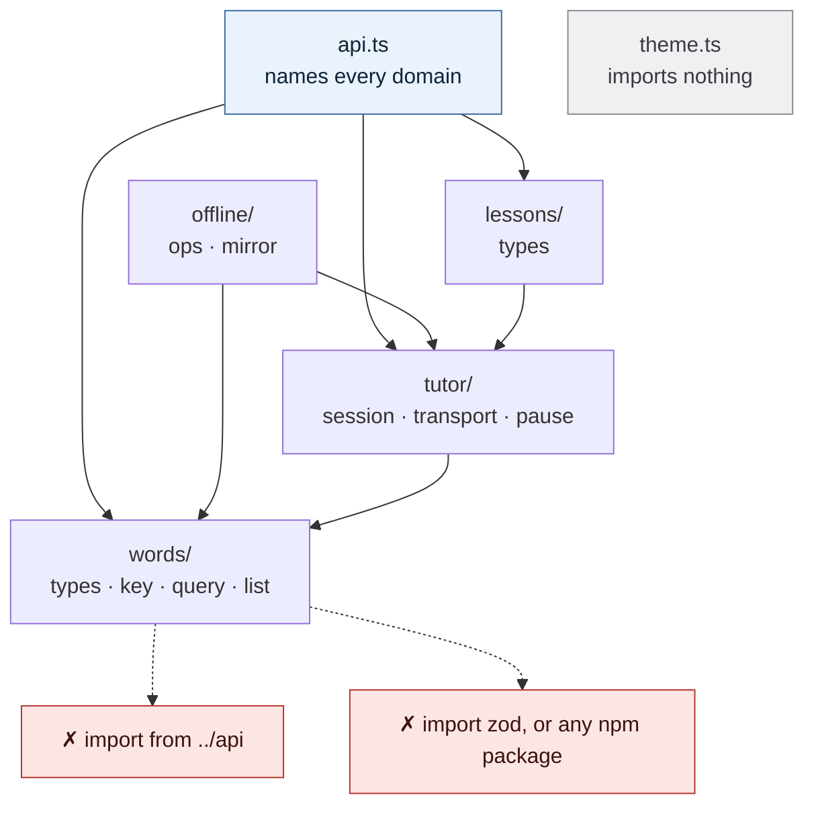
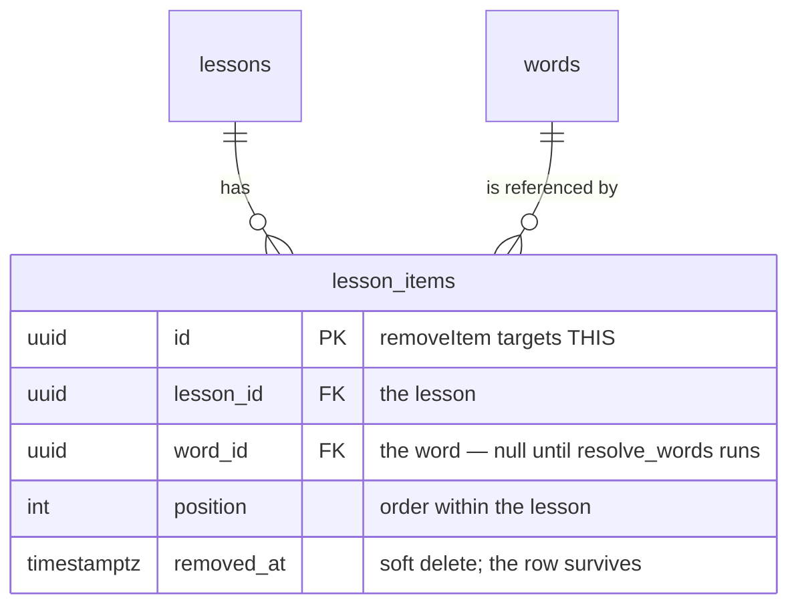

# @tutor/shared

The pure core: the shapes, vocabularies and rules the mobile app and the web backend must both agree
on. Zero runtime dependencies, no I/O, no framework, no platform. 13 files, ~1 400 lines.

The test for whether something belongs here, from the repo's `CLAUDE.md`:

> _If this had a bug, could I fix it by deploying the web app alone?_ If yes, it belongs on the server.

## The map

An arrow means **imports**. Nothing may point outward, and no domain may point at `api.ts`:



`testing/` sits outside that graph: it may import from any domain, and nothing shipped may import it.

| doc | covers |
| --- | --- |
| [docs/words.md](docs/words.md) | identity, the items-page URL grammar, in-memory search |
| [docs/tutor.md](docs/tutor.md) | the transcript, the provider seam, the held pause |
| [docs/offline.md](docs/offline.md) | the outbox op algebra, the device-database contract |
| [docs/api.md](docs/api.md) | the HTTP contract |
| below | lessons · theme · testing · the boundary rules |

## Lessons

`src/lessons/types.ts`. A word belongs to the learner, not to a lesson — so a word in no lesson is a
normal state, not an orphan to clean up. Two ids live on every `LessonItem` and they address
different rows:



`/lesson-items/:id` addresses the **word**; `removeItem` addresses the **join row**. Confuse them and
you delete the wrong thing.

- `Lesson` → `LessonDetail` adds `itemsDetailed` (only `getLesson` builds it — the list view stays
  lean), `LessonListItem` adds `sessionCount`.
- `NewLesson` has every id minted client-side, which is what makes offline create and idempotent sync
  possible. See [docs/offline.md](docs/offline.md).
- `ITEM_TRANSLATION_LIMIT = 2`. One Russian word covers one shade — `ephemeral` is мимолётный *or*
  недолговечный — so a single translation asserts a precision the data lacks; two is also where the
  lock screen's single line stops fitting.
- `itemLine` carries no index, so the lock-screen Live Activity and the Words panel cannot drift and
  a line can be windowed.

## Theme

`src/theme.ts`. One `Palette` of twelve roles, `DARK` and `LIGHT`, reaching both platforms from one
table. The web reads `CSS_VARIABLES` and writes custom properties; the phone reads
`paletteFor(scheme)` and gets the object.

It exists because the apps drifted: the LIGHT palettes were byte-identical, the DARK ones differed on
**every value** (`#0f1115` vs `#101014`), and nobody could see it because the two apps are never on
screen together. The web's values won.

Nine of the twelve variable names are mechanical (`bg → --bg`). Three are not:

| role | CSS variable |
| --- | --- |
| `sunken` | `--field-bg` |
| `onAccent` | `--on-accent` |
| `faint` | *none — the web reaches that tier with `.muted` at `0.85rem`* |

- `CSS_VARIABLES` is `Record<keyof Palette, string>`, so a new role without a variable will not compile.
- Anything that is not the literal `"light"` means dark. There is no third `"system"` state.
- `LIGHT` is designed, not inverted: `accent` is `#4361ee`, *not* dark's `#7c9cff`, which fails WCAG
  AA as link text on white.
- Colours only. Geometry stays per-platform.
- `parseScheme` is duplicated by necessity in the web's pre-paint script, which runs before the
  bundle loads. `check.ts` pins the rule so a divergence fails loudly.

## Testing

`pnpm check:shared` runs `tsx check.ts && bash check-boundaries.sh`. No device, no network, no renderer.

| harness | proves |
| --- | --- |
| `check.ts` | property checks over the behaviours with a history of breaking — the URL round-trip, the identity invariant over 528 adversarial pairs, the pause decisions |
| `src/testing/fake-transport.ts` | records every call into `calls`, so a pause decision is checked by what it *asked the transport to do*. Being a plain factory with no hooks, it is also the evidence that `TutorTransport` is React-free |
| `check-boundaries.sh` | violates each lint zone in a scratch file and asserts ESLint rejects it — a rule with no test can stop working unnoticed |

- **The fake is the *identity* transport, not a provider mock.** Modelling ElevenLabs or OpenAI timing
  would make it a second place that provider's behaviour is written down.
- **`canSilence: false` is the case worth testing** — the whole reason `setOutputSilenced` returns a
  boolean.
- **`theme.ts` cannot be probed with a scratch file** — its zone is pinned to that exact filename, so
  the script appends to the real file, lints, restores it and asserts `git diff --quiet`.
- **`check.ts` is a stopgap.** When the repo gains a test runner these become normal test files.

## The rules

**Dependencies point inward only.** Nothing here may import from an app or from any npm package.
`dependencies` is empty by design and a `types: []` tsconfig makes even `node:*` a compile error.
Enforced by `eslint.config.js`; `check-boundaries.sh` asserts the enforcement still works.

**The domains are ordered.** `words/` and `theme.ts` sit at the bottom, `api.ts` at the top. Because
`api.ts` names every domain, no domain may name it.

**There is no barrel.** Import the specific module — `@tutor/shared/words/types`, never
`@tutor/shared`. `"exports": { "./*": "./src/*.ts" }` substitutes greedily across `/`, so domain
folders need no `package.json` change.

**The package ships raw TypeScript, no build step.** Next uses `transpilePackages`; Metro consumes it
directly.

**`check.ts` sits outside `src/` on purpose**, so it can be a Node script and reach `src/testing/`
without holing the rule. Hence its own `tsconfig.check.json`. `lib` omits `DOM.Iterable`
deliberately: the core may construct a `URLSearchParams` but not iterate one.

**Mobile must never copy from this package.** If both clients need it, it goes here.

## How to add a module

1. Put it in the domain folder it belongs to.
2. Give it a locator header — one sentence and a pointer to its doc:
   ```ts
   /** The offline outbox op algebra. See ../../docs/offline.md. */
   ```
3. Add its exports to that doc's **Modules** table.
4. Run `pnpm typecheck && pnpm check:shared`, and `pnpm --filter mobile check` before pushing.

## The documentation charter

1. **Four domain docs, for the four domains that carry real complexity.** Everything else —
   lessons, theme, testing, the boundary rules — lives in this README. A new module joins an existing
   doc's Modules table; only a genuinely new domain earns a new file.
2. **Every doc has the same four parts:** the diagram, *Three things to know*, *Modules*, *Gotchas*.
3. **A gotcha is one line.** The rule survives; the war story goes to the research notes.
4. **A diagram must show what a sentence cannot** — an asymmetry, a decision with more than two
   outcomes, a failure and its recovery, a layering rule — and must carry real values. See
   [docs/diagrams/README.md](docs/diagrams/README.md).
5. **The code keeps a locator, not an essay.** One sentence and a pointer, so a reader who opened the
   file directly is never stranded.
6. **Subject names, never dates.** `/docs` at the repo root is a dated history; this folder is
   reference, and reference is looked up by subject. Link those notes rather than restating them.

Background: `docs/2026-08-09-shareable-core-refactor.md` and `docs/2026-08-22-shared-package-structure.md`.
