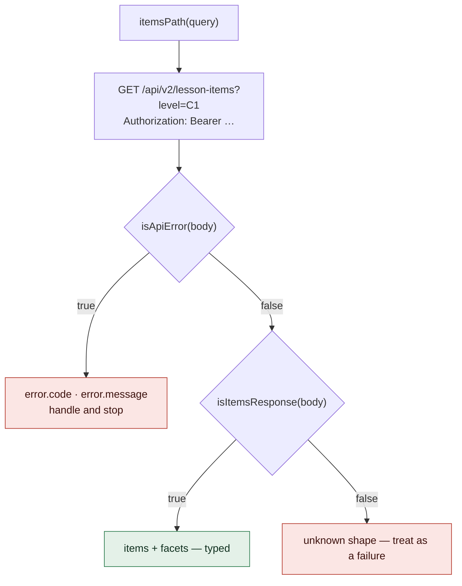

# API

The wire contract and nothing else: path constants, path builders, response interfaces and type
guards. No `fetch`, no `NextResponse`, no auth. It exists so a second client cannot hand-copy paths
and shapes — a renamed route then fails at build time rather than at runtime on someone's phone.

## Reading a response

A response is an error **iff** `error` is present, so the guards run in one fixed order:

`lib/http.ts` builds the server's real error responses from the `ApiErrorBody` declared here, so the
envelope is definitionally this type rather than a parallel description of it.

## Three things to know

1. **Two namespaces.** `/api/*` is the browser's, on an Auth0 cookie session. `/api/v2/*` is
   everything mobile calls and the only place the Bearer path runs.
2. **`isApiError` first, the route's own guard second.** Never the other way round.
3. **Each guard's required-field list encodes a rule** — see the gotchas.

## Routes

| `/api/v2/*` (Bearer) | path |
| --- | --- |
| `me` · `agentVersions` | `/me` · `/agent-versions` |
| `conversationToken` · `realtimeToken` | `/words-agent/token` · `/words-agent/openai-token` |
| `lessons` · `lessonSession` | `/lessons` · `/lessons/session` |
| `items` · `itemPopularity` · `itemDelete` | `/lesson-items` · `/lesson-items/popularity` · `/lesson-items/delete` |
| `syncFlush` · `suggest` | `/sync/flush` · `/lexicon/suggest` |

`/api/*` (browser session): `signedUrl`, `lessonSession`, `health`.

Builders: `lessonPath(id)` · `lessonItemsPath(id)` · `itemPath(id)` · `itemsPath(query)` ·
`suggestPath(prefix, limit)` · `signedUrlPath(version?)` · `conversationTokenPath(version?)`.

## Responses and their guards

| response | guard requires |
| --- | --- |
| `ItemsResponse` | `items` and `facets` are arrays |
| `LessonDetailResponse` | `lesson.id`, `lesson.itemsDetailed`, `sessions`, `sessionCount` |
| `LessonListResponse` · `LessonItemsResponse` · `SuggestResponse` | the one array is present |
| `ConversationTokenResponse` | non-empty `token`, `conversationId`, `appEnv` |
| `RealtimeTokenResponse` | non-empty `clientSecret`, `conversationId`, `version`, `model` — **not** `audioInput` |
| `MeResponse` · `AgentVersionsResponse` · `ItemDetailResponse` · `AddWordResponse` | `sub` · `defaultVersion` + `versions` · `item.id` · a known `status` |

Suggest constants: `SUGGEST_MIN_PREFIX` 2 · `SUGGEST_LIMIT` 8 · `SUGGEST_BUCKET_PREFIX` 2 ·
`SUGGEST_BUCKET_LIMIT` 2000. `MAX_LESSON_SESSIONS` is 20.

## Gotchas

- **`itemDelete` and `itemPopularity` are `POST` to literal paths, not `DELETE /:id`** — v2's
  `access-control-allow-methods` is `GET,POST,OPTIONS`, so a `DELETE` passes on device and fails
  preflight under `expo start --web`.
- **Values a client must never invent are required; pacing is not.** `conversationId` and `appEnv`
  are required; `audioInput` is not, because degrading beats refusing to start a lesson.
- **A derived `conversationId` silently forks history.** Four writers converge on one
  `lesson_sessions` row keyed by it, so an absent id is an error, never something to default.
- **`RealtimeAudioInput` must be sent back whole** in a `session.update`. Shipping only
  `turn_detection` risks replacing the block and dropping `transcription` — losing every learner
  transcript from the first pause onward, without failing.
- **Suggest sends the prefix raw** — Postgres owns normalization. Exactly `SUGGEST_BUCKET_LIMIT` rows
  means the bucket was TRUNCATED, so stop narrowing locally.
- **List routes return objects** (`{ lessons }`, `{ suggestions }`), never bare arrays, so they can
  grow a field without breaking an installed binary.

## Research

- [`2026-08-12-expo-app-creation.md`](../../../docs/2026-08-12-expo-app-creation.md)
- [`2026-08-22-openai-realtime-second-provider.md`](../../../docs/2026-08-22-openai-realtime-second-provider.md)
