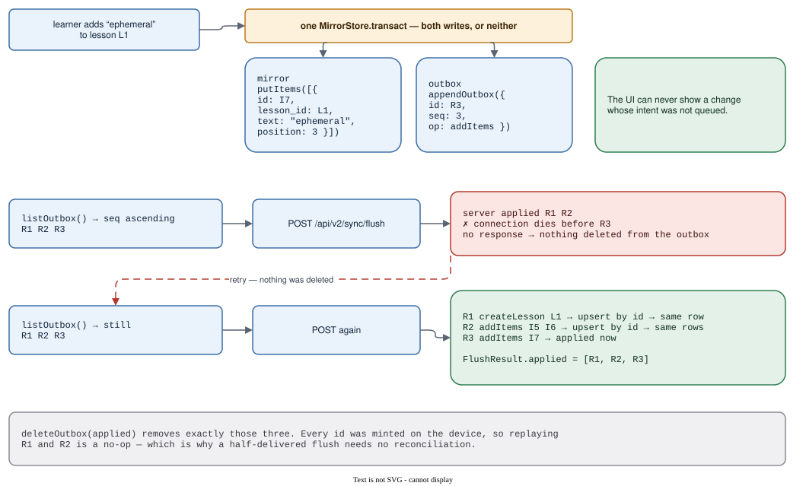

# Offline

A learner's write must land with no network. Every mutation is therefore written **twice on the
device** — once into the mirror the UI renders from, once as an `OutboxRecord` — inside a single
`MirrorStore.transact`.

## The write path, and a flush that dies half-way

That one transaction is the invariant: the UI can never show a change whose intent wasn't queued.
Ops are minted entirely client-side — ids, positions, titles — and are idempotent by construction, so
a partly-delivered flush replays onto exactly the same rows:

## Three things to know

1. **The mirror write and `appendOutbox` share one `transact`**, or neither happens.
2. **`listOutbox` returns `seq` ascending, and that *is* replay order.**
3. **`FlushResult.applied` is the only thing safe to `deleteOutbox`.**

## Modules

| file | exports | reach for it when |
| --- | --- | --- |
| `ops.ts` | the four op types, `OutboxRecord`, `FlushResult`, `planNewItems`, `buildAddItemsOp`, `buildCreateLessonOp`, `normalizeLessonTitle`, `nextLessonTitle`, `parseOutboxRecords`, `opLessonId`, the limits | you are queueing or replaying a write |
| `mirror.ts` | `MirrorLesson`, `MirrorItem`, `SessionJournalEntry`, `MirrorOps`, `MirrorStore`, `SessionJournalOps` | you are implementing a device database |

## The op algebra

| op | carries | idempotent because |
| --- | --- | --- |
| `createLesson` | lesson id, title, items (`id` + `text`) | upsert by lesson id |
| `addItems` | `lessonId`, items (`id` + `text` + `position`) | upsert by item id |
| `removeItem` | `lessonId`, `itemId` | soft delete — the row survives with `removed_at` set |
| `deleteLesson` | `lessonId` | delete by id |

Limits: `MAX_ITEMS` 50 per lesson · `MAX_FLUSH_RECORDS` 500 per flush · `MAX_LESSON_TITLE` 120 chars.
`nextLessonTitle` stamps `DD-MM-YYYY`, then appends ` 1`, ` 2` … for that day's later lessons.

## Gotchas

- **One transaction or nothing.** The mirror write, `maxOutboxSeq` and `appendOutbox` must share a
  `transact`. Same reason `clearAll` lives on `MirrorOps`: `ensureOwner` wipes and re-stamps atomically.
- **`parseOutboxRecords` is all-or-nothing.** Dropping one malformed member would apply a prefix and
  report the whole batch as success.
- **`MirrorStore` deliberately does not abstract reactive reads.** Dexie's `liveQuery` hooks
  IndexedDB's own mutation events; a SQLite adapter needs its own change feed. There is no honest
  generic form, so reactivity stays per-platform.
- **Both modules are pure** — `newId` and `date` are parameters, not ambient globals. That is what
  lets a browser sync engine and a Server Action share one copy of `MAX_ITEMS`.
- **`planNewItems` dedupes with `clientDedupeKey`, which is weaker than Postgres on purpose** — see
  [words.md](words.md). It may leave a duplicate for the server to skip; it can never merge two words
  the learner meant to keep apart.
- **Today the only full `MirrorStore` is Dexie** (`apps/web/src/lib/sync/`). Mobile shares the types
  and keeps its own `expo-sqlite` session journal.

## Research

- [`2026-07-04-offline-support-and-sync.md`](../../../docs/2026-07-04-offline-support-and-sync.md)
- [`2026-08-09-shareable-core-refactor.md`](../../../docs/2026-08-09-shareable-core-refactor.md)
