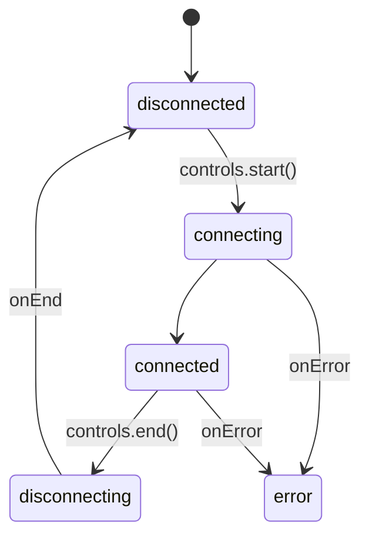
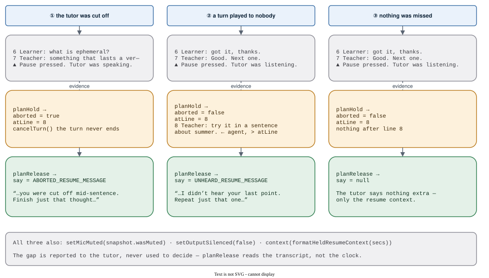

# Tutor

A lesson is a live voice call. This domain is the part of it no vendor owns: what gets stored
(`session.ts`), what a provider must satisfy (`transport.ts`), and how a pause is faked (`pause.ts`).

## The transport lifecycle

`TutorStatus` has exactly these five values:

`identified` is **not** among them. `onIdentified(descriptor)` is a callback that `start()` awaits
before the socket is up, and it is the only moment `conversationId` can be seeded and ownership
claimed — miss it and there is no second chance in that call.

## The held pause

The platform has no pause and no abort. A hold is faked — silence the output, mute the mic, barge in
to stop the turn in flight, heartbeat a keep-alive — and the hard part is deciding which single,
bounded thing the learner is owed on return. Two three-way decisions, chained:

Which message a pause earns depends on **what the transcript did** while the speaker was silenced,
never on how long the learner was away.

## Three things to know

1. **The lesson names no vendor.** `TutorTransport` is the entire provider contract; two adapters in
   `apps/mobile` (ElevenLabs, OpenAI Realtime) and `createFakeTransport` satisfy it.
2. **Capabilities are asked, not assumed.** `setOutputSilenced` returns a boolean — `false` means the
   tutor is still audible.
3. **Everything the tutor says on a resume is a constant here**, and every one of them is filtered
   back out of the stored transcript.

## Modules

| file | exports | reach for it when |
| --- | --- | --- |
| `session.ts` | `TranscriptLine`, `sanitizeTranscript`, `TutorItem`, `formatItemsList`, the message set, `formatResumeContext`, `formatHeldResumeContext`, `TUTOR_HEARTBEAT_MS` (1 s), `MIN_TURN_TIMEOUT_SECONDS` (3) | you are storing a transcript or writing what the tutor says |
| `transport.ts` | `TutorStatus`, `TutorCapabilities`, `TutorTransport`, `TutorTransportControls` / `Events` / `State`, `TutorUsage`, `TutorProviderId` | you are adding a provider |
| `pause.ts` | `planHold`, `planRelease` (pure) · `applyHold`, `applyRelease` (touch the wire) · `HoldSnapshot`, `HoldPlan`, `ReleasePlan` | you are touching pause or resume |

`sanitizeTranscript` caps a stored transcript at 500 lines × 4000 chars and drops any line without a
`user` / `agent` role. Every writer of a `lesson_sessions` row passes through it.

## The message set

| constant | said when |
| --- | --- |
| `KICKOFF_MESSAGE` | the lesson starts |
| `RESUME_MESSAGE` | a dropped connection reconnected — "we got cut off" |
| `PAUSE_RESUME_MESSAGE` | the learner pressed Pause and came back — "I'm back" |
| `PAUSE_STOP_MESSAGE` | barge-in, when the provider cannot cancel a turn |
| `ABORTED_RESUME_MESSAGE` | a turn was cut off mid-sentence — finish that thought |
| `UNHEARD_RESUME_MESSAGE` | a whole turn played into a silenced speaker — repeat just that one |

All of them, plus one legacy string, live in `HIDDEN_KICKOFF_MESSAGES`.

## Gotchas

- **`planRelease` checks `snapshot.aborted` first.** A turn we cut off is owed its tail even if
  another agent turn landed afterwards.
- **`PAUSE_RESUME_MESSAGE` vs `RESUME_MESSAGE` is not cosmetic.** Saying "we got cut off" to someone
  who pressed Pause is a lie the tutor speaks aloud.
- **Filter transcripts on `HIDDEN_KICKOFF_MESSAGES`, never one constant.** The webhook once filtered
  only `KICKOFF_MESSAGE` and leaked `RESUME_MESSAGE` into history as a learner turn.
- **`conversationId` comes from `onIdentified` and is authoritative.** `onTransportId` is a tripwire
  and must never be stored — four writers converge on that one row.
- **`UNHEARD_RESUME_MESSAGE` is chosen by evidence, not timing** — any `role === "agent"` line after
  `snapshot.atLine` means a whole turn played to nobody.
- **`TutorTransportControls` identity must be stable for the transport's life** — screens put its
  members in effect dependency arrays.

## Research

- [`2026-08-22-openai-realtime-second-provider.md`](../../../docs/2026-08-22-openai-realtime-second-provider.md)
- [`2026-08-16-tutor-pause-hold-the-line.md`](../../../docs/2026-08-16-tutor-pause-hold-the-line.md)
- [`2026-08-17-short-turns-and-chunked-pause.md`](../../../docs/2026-08-17-short-turns-and-chunked-pause.md)
