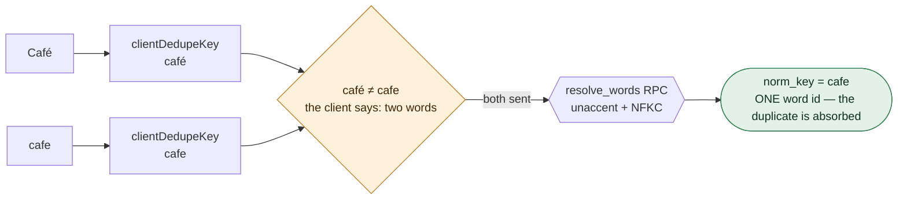

# Words

The learner's vocabulary: the CEFR vocabularies, how a typed string becomes a word, the items-page
URL grammar, and the in-memory search behind the list.

## Three normalizations, one authority

Postgres owns word identity: text becomes a word id only through the `resolve_words` RPC, which
needs `unaccent` plus Postgres's own punctuation table. `key.ts` ships three folds that are
*deliberately* not that, and the direction each one errs in is the whole design:



`wordInputKey` only trims and caps at 500 chars. `clientDedupeKey` adds lowercasing and stops there,
so it merges **less** than Postgres — the safe direction, because the worst it can do is leave a
duplicate for the server to skip. `lexiconPrefixFold` errs the other way: it strips diacritics too,
so it merges **as much as** Postgres. That makes it right for narrowing a list already on the device
and useless as proof of absence — which is why its caller must fall back to the server on an empty
result.

## Three things to know

1. **The client may only ever merge *less* than Postgres.** Never strengthen `clientDedupeKey`:
   merging less leaves a duplicate the server skips, merging more silently drops a word the learner
   typed.
2. **The URL is the filter state.** `parseItemsQuery` whitelists every value; `serializeItemsQuery`
   omits every default. Round-tripping is a fixed point.
3. **Filters go to the database; `?q=` search runs in memory** over rows already loaded.

## Modules

| file | exports | reach for it when |
| --- | --- | --- |
| `types.ts` | `CEFR_LEVELS` (A2–C2), `LEXICON_LEVELS` (A1–C2), `ITEM_KINDS`, `ItemRow`, `ItemDetail`, `WordDetails`, `ItemFacet`, `AddWordResult` | you need a word shape or a level vocabulary |
| `key.ts` | `MAX_WORD_LENGTH`, `wordInputKey`, `clientDedupeKey`, `lexiconPrefixFold` | you are about to normalize typed text |
| `query.ts` | `ItemsQuery`, `parseItemsQuery`, `serializeItemsQuery`, `searchParamsToBag`, `parseSearchTerm`, `isValidLevel/Sort/Kind`, `SORT_KEYS`, `DEFAULT_SORT`, `DEFAULT_DIR` | you are reading or writing the items-page URL |
| `list.ts` | `searchItems`, `groupFacets`, `sortChoices`, `SORT_LABELS` | you are rendering the collection |

## The query round-trip

One request, with a junk value and an injection attempt in it:

```text
?level=B2&level=C1&level=Z9&kind=sentence&sort=practice&dir=desc&hacked=1
  │
  ├─ parseItemsQuery ─── repeated key → array; every value past a whitelist
  ▼
{ levels: ["B2", "C1"], kind: "sentence", unassignedOnly: false,
  categories: {}, sort: "practice", dir: "desc" }
  │
  ├─ serializeItemsQuery ─── omits anything equal to a default
  ▼
?level=B2&level=C1&kind=sentence&sort=practice
```

`Z9` and `hacked=1` are gone — nothing unrecognised survives the parse. `dir=desc` is gone because it
*is* `DEFAULT_DIR`. Serializing again returns the same string; `check.ts` asserts that fixed point
over 5 376 generated cases.

## Search

`searchItems` folds both sides with `lexiconPrefixFold`, tries a substring match, and only then pays
for a Levenshtein prefix distance per token. The edit budget comes from the needle's length:

| needle length | edits allowed |
| --- | --- |
| 1–3 | 0 — substring only |
| 4–6 | 1 |
| 7+ | 2 |

## Gotchas

- **`norm_key` applies to the *capped* text**, which is why `clientDedupeKey` builds on
  `wordInputKey` — otherwise two strings differing past character 500 would split.
- **`CefrLevel` (A2–C2) ≠ `LexiconLevel` (A1–C2).** A dictionary contains `the` and `water`; a
  learner's collection does not start at A1. `LexiconLevel` is derived by spread, so `CefrLevel`
  stays a strict subset by construction.
- **`lexiconPrefixFold` matches Postgres**, so an empty local result is not proof of absence — the
  caller's server fallback is not optional.
- **`isValidLevel` / `isValidSort` / `isValidKind` are security-relevant** — they are what stops an
  arbitrary string reaching PostgREST.
- **`?q=` is deliberately outside `ItemsQuery`.** Filters go to the database; search does not,
  because a round-trip per keystroke is the wrong interaction at 50 items per lesson.

## Research

- [`2026-07-16-add-word-on-lesson-items-page.md`](../../../docs/2026-07-16-add-word-on-lesson-items-page.md)
- [`2026-07-11-lesson-items-page-search-filters-stats-favorites.md`](../../../docs/2026-07-11-lesson-items-page-search-filters-stats-favorites.md)
- [`2026-08-15-word-autocomplete-suggestions.md`](../../../docs/2026-08-15-word-autocomplete-suggestions.md)
